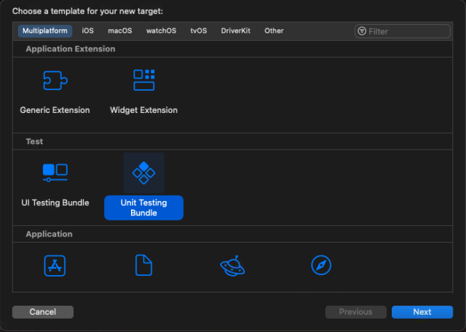

# Test IT Swift integrations


## Compatibility

XCTest support only for now

| TestIT   | Adapters      |
|----------|---------------|
| 5.3      | 0.1.2-tms.5.3 |
| 5.4      | 0.3.2-tms.5.4 |
| Cloud    | 0.3.3         |


## Examples

You can use our project example as reference and your working template with all configured in Xcode. 

https://github.com/testit-tms/swift-examples


## Getting Started

### Installation in Xcode

1. Open your project in Xcode. 
2. Go to project settings -> Package Dependencies -> Click "+"
3. Enter in the search menu on the top right https://github.com/testit-tms/adapters-swift , select correct version for your TMS version, click "Add Package" 


4. Select test target in the project or create new one (Xcode File -> New -> Target... -> Multiplatform -> Unit testing bundle)



5. From project settings select your test target
6. Go to Build Phases Column ->  Open "Link Binary with Libraries" -> Click "+", add "testit-adapter-swift"


### How to use

1. Open any of your test files in the test target with XCTestCase, add this dependencies:

```swift
import XCTest
import testit_adapters_swift
```

2. You can should your test classes inheritance from `XCTestCase` to `TestItXCTestCase`

```swift
// with adapterMode 2, each test class running in the separate isolated environment and produce it's own test-run.
// use adapterMode 1 or 0 with provided testRunId for populating all test classes results in one testrun
class ExampleTests: TestItXCTestCase {
    // ...   
}
```

3. Our adapter supports setup and teardown, you can also add XCTest assertion to them

```swift
    override func setUp() {
        super.setUp()
        // any user related code
        XCTAssertTrue(true)
    }

    override func tearDown() {
        super.tearDown()
        // any user related code
        XCTAssertTrue(true)
    }
```

4. All test* functions will be valid tests as well as in the usual XCTestCase. 

*Attention!* Keep in mind that every XCTestCase class runs in it's own isolated environment, that's why in Test IT with adapterMode 2 will be 1 testRun for each XCTestCase class.

*Attention!* *attachments must be available for test bundle for read permission (add these files to the test target, always mark "Copy Sources If Needed")

Test examples with custom metadata [(from swift-examples)](https://github.com/testit-tms/swift-examples):

```swift
    func testExampleOk() {
        print("Running testExampleOk")
        
        // attachments must be available for test bundle for read permission (add it to the test target)
        let testBundle = Bundle(for: type(of: self))
        let filePath = testBundle.path(forResource: "file", ofType: "txt")

        TestItContextBuilder()
            //.ExternalId("ext-123")
            //.Name("Example1")
        
            // autotest links
            .Links([LinkEntity(title: "TestLink", url: "https://test.com",
                description: "TestDescription", type: LinkEntityType.related)])
            // test result's links
            .AddLinks([LinkEntity(title: "TestLink", url: "https://test.com",
                description: "TestDescription", type: LinkEntityType.related)])
            .Parameters(["version": "1.0", "env": "staging"])
            .Labels([LabelEntity(name: "TestLabel")])
            // test result's attachments
            .Attachments([filePath!])
            .build(self)
        
        XCTAssertTrue(true)
    }
    
    func testExampleFailed() {
        print("Running testExampleFailed")
        
        TestItContextBuilder()
            //.ExternalId("ext-321")
            //.Name("Example2")
            .Description("failed test example")
            .Parameters(["version": "1.0", "env": "staging"])
            .build(self)
        
        XCTAssertEqual(2 + 3, 6)
    }
```


### Configuration

| Description                                                                                                                                                                                                                                                                                                                                                                            | File property                     | Environment variable                       | System property                      |
|----------------------------------------------------------------------------------------------------------------------------------------------------------------------------------------------------------------------------------------------------------------------------------------------------------------------------------------------------------------------------------------|-----------------------------------|--------------------------------------------|--------------------------------------|
| Location of the TMS instance                                                                                                                                                                                                                                                                                                                                                           | url                               | TMS_URL                                    | tmsUrl                               |
| API secret key [How to getting API secret key?](https://github.com/testit-tms/.github/tree/main/configuration#privatetoken)                                                                                                                                                                                                                                                                                                                                   | privateToken                      | TMS_PRIVATE_TOKEN                          | tmsPrivateToken                      |
| ID of project in TMS instance [How to getting project ID?](https://github.com/testit-tms/.github/tree/main/configuration#projectid)                                                                                                                                                                                                                                                                                                                        | projectId                         | TMS_PROJECT_ID                             | tmsProjectId                         |
| ID of configuration in TMS instance [How to getting configuration ID?](https://github.com/testit-tms/.github/tree/main/configuration#configurationid)                                                                                                                                                                                                                                                                                                            | configurationId                   | TMS_CONFIGURATION_ID                       | tmsConfigurationId                   |
| ID of the created test run in TMS instance.<br/>It's necessary for **adapterMode** 0 or 1                                                                                                                                                                                                                                                                                              | testRunId                         | TMS_TEST_RUN_ID                            | tmsTestRunId                         |
| Parameter for specifying the name of test run in TMS instance (**It's optional**). If it is not provided, it is created automatically                                                                                                                                                                                                                                                  | testRunName                       | TMS_TEST_RUN_NAME                          | tmsTestRunName                       |
| Adapter mode. Default value - 0. The adapter supports following modes:<br/>0 - in this mode, the adapter filters tests by test run ID and configuration ID, and sends the results to the test run<br/>1 - in this mode, the adapter sends all results to the test run without filtering<br/>2 - in this mode, the adapter creates a new test run and sends results to the new test run | adapterMode                       | TMS_ADAPTER_MODE                           | tmsAdapterMode                       |
| Mode of automatic creation test cases (**It's optional**). Default value - false. The adapter supports following modes:<br/>true - in this mode, the adapter will create a test case linked to the created autotest (not to the updated autotest)<br/>false - in this mode, the adapter will not create a test case                                                                    | automaticCreationTestCases        | TMS_AUTOMATIC_CREATION_TEST_CASES          | tmsAutomaticCreationTestCases        |
| Mode of automatic updation links to test cases (**It's optional**). Default value - false. The adapter supports following modes:<br/>true - in this mode, the adapter will update links to test cases<br/>false - in this mode, the adapter will not update link to test cases                                                                                                         | automaticUpdationLinksToTestCases | TMS_AUTOMATIC_UPDATION_LINKS_TO_TEST_CASES | tmsAutomaticUpdationLinksToTestCases |
| Mode of import type selection when launching autotests (**It's optional**). Default value - true. The adapter supports following modes:<br/>true - in this mode, the adapter will create/update each autotest in real time<br/>false - in this mode, the adapter will create/update multiple autotests                                                                                 | importRealtime                    | TMS_IMPORT_REALTIME                        | tmsImportRealtime                    |
| Name of the configuration file If it is not provided, it is used default file name (**It's optional**)                                                                                                                                                                                                                                                                                 | -                                 | TMS_CONFIG_FILE                            | tmsConfigFile                        |

#### File

Create **testit.properties** file in the resource directory of the project:
``` 
url=URL
privateToken=USER_PRIVATE_TOKEN
projectId=PROJECT_ID
configurationId=CONFIGURATION_ID
adapterMode=ADAPTER_MODE
testRunId=TEST_RUN_ID
testRunName=TEST_RUN_NAME
automaticCreationTestCases=AUTOMATIC_CREATION_TEST_CASES

```

### Annotations

Use annotations to specify information about autotest.

```swift
TestItContextBuilder()
    //.ExternalId("ext-123")
    //.Name("Example1")

    // autotest links
    .Links([LinkEntity(title: "TestLink", url: "https://test.com",
        description: "TestDescription", type: LinkEntityType.related)])
    // test result's links
    .AddLinks([LinkEntity(title: "TestLink", url: "https://test.com",
        description: "TestDescription", type: LinkEntityType.related)])
    .Parameters(["version": "1.0", "env": "staging"])
    .Labels([LabelEntity(name: "TestLabel")])
    // test result's attachments
    .Attachments([filePath!])
    .build(self)
```

Description of Metadata builder methods:

- `WorkItemIds` - a method that links autotests with manual tests. Receives the array of manual tests' IDs
- `DisplayName` - internal autotest name (used in Test IT) (TODO)
- `ExternalId` - unique internal autotest ID (used in Test IT)
- `Title` - autotest name specified in the autotest card. If not specified, the name from the displayName method is used
- `Description` - autotest description specified in the autotest card
- `Labels` - tags listed in the autotest card
- `Links` - links listed in the autotest card
- `Classname` - name of the classname (TODO)
- `Namespace` - name of the package (TODO)
- `AddLinks` - add links to the autotest result.
- `Attachments` - add attachments to the autotest result.
- `Message` - add message to the autotest result.


# Contributing

You can help to develop the project. Any contributions are **greatly appreciated**.

* If you have suggestions for adding or removing projects, feel free
  to [open an issue](https://github.com/testit-tms/adapters-java/issues/new) to discuss it, or create a direct pull
  request after you edit the *README.md* file with necessary changes.
* Make sure to check your spelling and grammar.
* Create individual PR for each suggestion.
* Read the [Code Of Conduct](https://github.com/testit-tms/adapters-java/blob/main/CODE_OF_CONDUCT.md) before posting
  your first idea as well.

# License

Distributed under the Apache-2.0 License.
See [LICENSE](https://github.com/testit-tms/adapters-java/blob/main/LICENSE.md) for more information.
