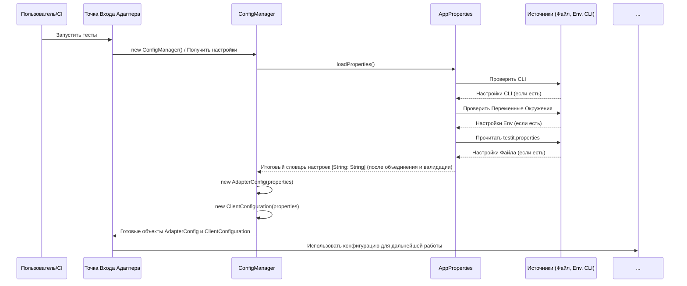

# Chapter 1: Конфигурация Адаптера


Добро пожаловать в руководство по `adapters-swift`! Эта библиотека помогает связать ваши автоматические тесты Xcode с системой управления тестированием TestIT.

Представьте, что вы собираетесь отправиться в путешествие на автомобиле (ваши тесты). Прежде чем тронуться с места, вам нужно настроить навигатор: ввести адрес назначения (куда отправлять результаты тестов), проверить топливо (убедиться, что есть доступ к серверу) и, возможно, выбрать маршрут (как именно запускать тесты).

Вот именно для этого и нужна конфигурация адаптера. Она служит "панелью управления" или "навигатором" для `adapters-swift`, сообщая ему всю необходимую информацию для правильной работы: куда подключаться, с какими правами и что делать с тестами. Без этих настроек адаптер просто не будет знать, как и куда отправлять результаты ваших тестов.

**Главная задача этой главы:** Понять, что такое конфигурация адаптера, какие параметры она включает и как адаптер получает эти настройки.

## Что такое Конфигурация Адаптера?

**Конфигурация Адаптера** — это набор настроек, которые определяют, как адаптер будет работать. Сюда входят:

*   **Адрес сервера TestIT (`url`):** Веб-адрес вашего экземпляра TestIT.
*   **Токен доступа (`privateToken`):** Ваш секретный ключ API для аутентификации на сервере TestIT. **Важно:** Обращайтесь с ним осторожно, как с паролем!
*   **ID проекта (`projectId`):** Уникальный идентификатор вашего проекта в TestIT.
*   **ID конфигурации (`configurationId`):** Идентификатор конфигурации тестов внутри проекта TestIT.
*   **Режим работы (`adapterMode`):** Указывает, как адаптер должен запускать тесты (например, запускать все тесты, использовать фильтры из тест-плана TestIT или создавать новый тест-ран).
*   **ID текущего тест-рана (`testRunId`):** Если вы хотите добавить результаты к уже существующему тест-рану в TestIT, вы указываете его ID здесь.
*   **Автоматическое создание тест-кейсов (`automaticCreationTestCases`):** Разрешить ли адаптеру автоматически создавать новые тест-кейсы в TestIT, если он встречает тест, которого там еще нет?
*   **Интеграция с TMS (`tmsIntegration`):** Глобальный переключатель, чтобы включить или выключить всю интеграцию с TestIT.

Думайте об этом как о настройках приложения: вы задаете все параметры перед запуском, чтобы адаптер знал, что делать.

## Откуда берутся настройки?

Адаптер достаточно гибок и может получать настройки из трех основных источников, причем у них есть приоритет:

1.  **Аргументы командной строки (CLI):** Параметры, переданные при запуске тестов из терминала (например, `--tmsUrl=...`). **Имеют наивысший приоритет.**
2.  **Переменные окружения (Environment Variables):** Системные переменные (например, `TMS_URL=...`). Имеют средний приоритет.
3.  **Файл `testit.properties`:** Специальный текстовый файл в вашем проекте, где настройки хранятся в формате `ключ=значение`. **Имеет самый низкий приоритет.**

Адаптер сначала ищет настройку в аргументах командной строки. Если не находит, ищет в переменных окружения. И только если ни там, ни там нет, он смотрит в файл `testit.properties`. Это позволяет легко переопределять базовые настройки из файла для конкретных запусков (например, на CI/CD сервере).

### Пример файла `testit.properties`

Это простой текстовый файл, который вы можете добавить в свой Xcode проект.

```properties
# Адрес вашего сервера TestIT
url=https://your_company.testit.software

# Ваш личный токен API (лучше использовать переменные окружения!)
privateToken=ВАШ_СУПЕР_СЕКРЕТНЫЙ_ТОКЕН

# ID проекта в TestIT (в формате UUID)
projectId=xxxxxxxx-xxxx-xxxx-xxxx-xxxxxxxxxxxx

# ID конфигурации тестов в TestIT (в формате UUID)
configurationId=yyyyyyyy-yyyy-yyyy-yyyy-yyyyyyyyyyyy

# Режим работы: 0 - использовать фильтр, 1 - запустить все, 2 - создать новый тест-ран
adapterMode=2

# Создавать ли тест-кейсы автоматически? (true/false)
automaticCreationTestCases=false

# Включить интеграцию? (true/false)
testIt=true
```

**Примечание:** Хранить `privateToken` прямо в файле не очень безопасно. Лучше использовать переменные окружения или систему управления секретами вашего CI/CD.

## Как адаптер использует конфигурацию?

Внутри `adapters-swift` есть несколько ключевых компонентов, отвечающих за работу с конфигурацией:

1.  **`AppProperties`:** Этот компонент отвечает за чтение настроек из всех источников (файл, переменные окружения, CLI) и их объединение с учетом приоритета. Он также содержит константы для имен всех ключей конфигурации.

    ```swift
    // Пример определения ключей в AppProperties.swift
    enum AppProperties {
        static let URL = "url"
        static let PRIVATE_TOKEN = "privateToken"
        static let PROJECT_ID = "projectId"
        // ... и другие ключи ...
        static let ADAPTER_MODE = "adapterMode"
        static let PROPERTIES_FILE = "testit.properties"

        // Метод для загрузки и объединения всех настроек
        static func loadProperties() -> [String: String] {
            var properties: [String: String] = [:]
            // 1. Загрузка из файла testit.properties (если есть)
            // ... код загрузки из файла ...
            // 2. Загрузка из переменных окружения (переопределяет файл)
            // ... код загрузки из ProcessInfo.processInfo.environment ...
            // 3. Загрузка из аргументов CLI (переопределяет все)
            // ... код загрузки из CommandLine.arguments ...
            // 4. Валидация обязательных полей
            // ... код проверки ...
            return properties // Возвращает итоговый словарь настроек
        }
    }
    ```
    Этот код показывает, что `AppProperties` знает имена всех настроек и имеет логику (`loadProperties`), чтобы собрать их из разных мест.

2.  **`AdapterConfig`:** Этот объект хранит настройки, касающиеся *поведения самого адаптера*: режим работы, нужно ли создавать тест-кейсы и т.д. Он создается на основе словаря настроек, полученного от `AppProperties`.

    ```swift
    // Упрощенный пример AdapterConfig.swift
    struct AdapterConfig {
        let mode: AdapterMode // Режим работы (enum)
        let automaticCreationTestCases: Bool // Создавать ли тест-кейсы
        let tmsIntegration: Bool // Включена ли интеграция

        // Инициализатор, который берет значения из словаря
        init(properties: [String: String]) {
            // Устанавливаем режим, используем .useFilter по умолчанию
            if let modeValue = properties[AppProperties.ADAPTER_MODE],
               let modeInt = Int(modeValue),
               let parsedMode = AdapterMode(rawValue: modeInt) {
                self.mode = parsedMode
            } else {
                self.mode = .useFilter
            }

            // Устанавливаем флаг авто-создания, false по умолчанию
            self.automaticCreationTestCases = (properties[AppProperties.AUTOMATIC_CREATION_TEST_CASES]?.lowercased() == "true")

             // Устанавливаем флаг интеграции, true по умолчанию
             self.tmsIntegration = (properties[AppProperties.TMS_INTEGRATION]?.lowercased() != "false")
        }
    }

    // Возможные режимы работы
    public enum AdapterMode: Int {
        case useFilter = 0   // Использовать фильтр из TestIT
        case runAllTests = 1 // Запустить все найденные тесты
        case newTestRun = 2  // Создать новый тест-ран в TestIT
    }
    ```
    `AdapterConfig` берет общие настройки и извлекает те, что важны для *логики работы* адаптера. `AdapterMode` - это перечисление (enum), которое делает код более читаемым, чем просто числа 0, 1, 2.

3.  **`ClientConfiguration`:** Этот объект хранит настройки, необходимые для *подключения к TestIT*: адрес сервера, токен, ID проекта и т.д. Он также создается на основе общего словаря настроек.

    ```swift
    // Упрощенный пример ClientConfiguration.swift
    struct ClientConfiguration {
        let url: String
        let privateToken: String
        let projectId: String
        let configurationId: String
        var testRunId: String // Может меняться, если создается новый тест-ран
        // ... другие поля ...

        // Инициализатор, который берет значения из словаря
        init(properties: [String: String]) {
            self.url = properties[AppProperties.URL] ?? "" // Адрес сервера
            self.privateToken = properties[AppProperties.PRIVATE_TOKEN] ?? "" // Токен
            self.projectId = properties[AppProperties.PROJECT_ID] ?? "" // ID проекта
            self.configurationId = properties[AppProperties.CONFIGURATION_ID] ?? "" // ID конфигурации
            self.testRunId = properties[AppProperties.TEST_RUN_ID] ?? "" // ID тест-рана (если есть)
            // ... загрузка остальных полей ...
        }
    }
    ```
    `ClientConfiguration` собирает все данные, нужные для установления *связи* с сервером TestIT.

4.  **`ConfigManager`:** Это простой менеджер, который использует `AppProperties` для загрузки настроек, а затем создает и предоставляет экземпляры `AdapterConfig` и `ClientConfiguration`.

    ```swift
    // Упрощенный пример ConfigManager.swift
    class ConfigManager {
        private let properties: [String: String] // Хранит загруженные настройки

        // Загружает настройки при инициализации
        init() {
            self.properties = AppProperties.loadProperties()
        }

        // Возвращает конфигурацию поведения адаптера
        func getAdapterConfig() -> AdapterConfig {
            return AdapterConfig(properties: self.properties)
        }

        // Возвращает конфигурацию для подключения к TestIT
        func getClientConfiguration() -> ClientConfiguration {
            return ClientConfiguration(properties: self.properties)
        }
    }
    ```
    `ConfigManager` действует как фабрика конфигураций, упрощая их получение для других частей адаптера.

## Как все работает вместе: Шаг за шагом

Когда вы запускаете тесты с подключенным адаптером `adapters-swift`:

1.  **Запуск:** Адаптер инициализируется (обычно это происходит через [Менеджер Адаптера (AdapterManager)](03_менеджер_адаптера__adaptermanager__.md)).
2.  **Запрос Конфигурации:** `AdapterManager` (или другой стартовый компонент) обращается к `ConfigManager` за настройками.
3.  **Загрузка Настроек:** `ConfigManager` инициализирует `AppProperties` (если еще не сделано) и вызывает `AppProperties.loadProperties()`.
4.  **Поиск Источников:** `AppProperties.loadProperties()` последовательно проверяет:
    *   Аргументы командной строки (CLI).
    *   Переменные окружения.
    *   Файл `testit.properties`.
5.  **Объединение:** Найденные значения объединяются в один словарь `[String: String]`, при этом более приоритетные источники перезаписывают значения из менее приоритетных.
6.  **Валидация:** `AppProperties` проверяет наличие и корректность обязательных полей (URL, токен, ID проекта и т.д.). Если что-то не так, адаптер обычно выдает ошибку и останавливается.
7.  **Создание Объектов:** `ConfigManager` получает итоговый словарь настроек и использует его для создания объектов `AdapterConfig` и `ClientConfiguration`.
8.  **Использование:** Другие компоненты адаптера (например, [Клиент API TestIT (ApiClient / TmsApiClient)](08_клиент_api_testit__apiclient___tmsapiclient__.md)) получают эти объекты конфигурации от `ConfigManager` и используют их для своей работы (подключения к серверу, определения режима запуска и т.д.).

Вот упрощенная диаграмма этого процесса:



## Заключение

Конфигурация адаптера — это его "мозг" и "карта". Она говорит ему, *что* делать (режим работы, авто-создание тестов) и *куда* подключаться (адрес сервера, проект, токен). Адаптер умеет гибко загружать эти настройки из файла `testit.properties`, переменных окружения или аргументов командной строки, отдавая приоритет последним.

Ключевые компоненты для работы с конфигурацией:

*   `AppProperties`: Читает и объединяет настройки из всех источников.
*   `AdapterConfig`: Хранит настройки поведения адаптера.
*   `ClientConfiguration`: Хранит настройки для подключения к TestIT.
*   `ConfigManager`: Управляет процессом загрузки и предоставляет готовые объекты конфигурации.

Понимание того, как настраивается адаптер, — это первый и очень важный шаг к его успешному использованию.

В следующей главе мы познакомимся с базовым классом для ваших тестов, который помогает адаптеру собирать информацию о них.

**Далее:** [Глава 2: Базовый Тестовый Класс (TestItTestCase)](02_базовый_тестовый_класс__testittestcase__.md)

---

Generated by [AI Codebase Knowledge Builder](https://github.com/The-Pocket/Tutorial-Codebase-Knowledge)