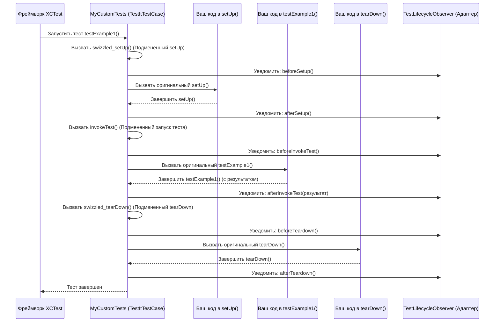

# Chapter 2: Базовый Тестовый Класс (TestItTestCase)


В предыдущей главе, [Конфигурация Адаптера](01_конфигурация_адаптера_.md), мы узнали, как настроить адаптер `adapters-swift`, указав ему, куда и как отправлять результаты тестов. Мы словно настроили навигатор для нашего тестового автомобиля. Теперь пришло время сесть за руль и убедиться, что сам автомобиль (наши тесты) готов к поездке и знает, как общаться с этим навигатором.

## Зачем нужен специальный базовый класс?

Представьте, что вы пишете много автоматических тестов для вашего приложения. Каждый тест обычно содержит какие-то шаги подготовки (например, вход в систему), сам тест (проверка какой-то функции) и шаги завершения (выход из системы). В Xcode для этого есть стандартные методы `setUp` (подготовка) и `tearDown` (завершение) в классе `XCTestCase`.

Но как адаптеру `adapters-swift` узнать, когда именно начался каждый тест, когда он закончился и с каким результатом (успех или провал)? Можно было бы вручную вставлять код для отправки этих данных в TestIT в начало и конец *каждого* тестового метода, а также в `setUp` и `tearDown`. Но это неудобно, утомительно и легко забыть сделать!

**Проблема:** Нам нужен способ автоматически "перехватывать" моменты начала и конца выполнения тестов, чтобы отправлять информацию в TestIT, не заставляя нас писать один и тот же код снова и снова.

## Встречайте `TestItTestCase`: Ваш "Умный Бланк" для Тестов

**`TestItTestCase`** — это наш спаситель! Это специальный класс, предоставленный библиотекой `adapters-swift`. Думайте о нем как об "умном бланке" для ваших тестов. Вместо того чтобы писать тесты на обычном "бланке" (`XCTestCase`), вы пишете их на этом "умном" (`TestItTestCase`).

**В чем его "ум"?** Он уже содержит встроенный механизм, который автоматически:
1.  Замечает, когда начинается выполнение вашего метода `setUp`.
2.  Замечает, когда заканчивается выполнение вашего метода `setUp`.
3.  Замечает, когда начинается выполнение вашего тестового метода (например, `testLogin`).
4.  Замечает, когда заканчивается выполнение вашего тестового метода и какой у него результат.
5.  Замечает, когда начинается выполнение вашего метода `tearDown`.
6.  Замечает, когда заканчивается выполнение вашего метода `tearDown`.

Всю эту информацию он передает другим компонентам адаптера, которые затем отправляют ее в TestIT. И самое главное — вам почти ничего не нужно менять в ваших тестах!

## Как его использовать? Проще простого!

Использование `TestItTestCase` сводится к одному простому шагу: **изменить родительский класс ваших тестовых классов с `XCTestCase` на `TestItTestCase`**.

**Было:**

```swift
// Обычный тестовый класс XCTest
import XCTest

class MyLoginTests: XCTestCase { // Наследуемся от стандартного XCTestCase

    override func setUp() {
        super.setUp()
        // Ваша логика подготовки к тесту
        print("Стандартный setUp запущен")
    }

    override func tearDown() {
        // Ваша логика завершения теста
        print("Стандартный tearDown запущен")
        super.tearDown()
    }

    func testSuccessfulLogin() {
        print("Выполняется тест testSuccessfulLogin")
        // Шаги теста...
        XCTAssertTrue(true) // Пример проверки
    }
}
```
В этом коде адаптер `adapters-swift` ничего не знает о том, когда запускается `setUp`, `tearDown` или `testSuccessfulLogin`.

**Стало:**

```swift
// Тестовый класс, интегрированный с TestIT
import XCTest
import SharedTestitLibrary // Не забудьте импортировать библиотеку адаптера

class MyLoginTests: TestItTestCase { // <-- ИЗМЕНЕНИЕ ЗДЕСЬ! Наследуемся от TestItTestCase

    override func setUp() {
        super.setUp() // Важно вызвать super.setUp()!
        // Ваша логика подготовки к тесту ОСТАЕТСЯ ПРЕЖНЕЙ
        print("Пользовательский setUp запущен")
    }

    override func tearDown() {
        // Ваша логика завершения теста ОСТАЕТСЯ ПРЕЖНЕЙ
        print("Пользовательский tearDown запущен")
        super.tearDown() // Важно вызвать super.tearDown()!
    }

    func testSuccessfulLogin() {
        print("Выполняется тест testSuccessfulLogin")
        // Шаги теста...
        XCTAssertTrue(true) // Пример проверки
    }
}
```
Теперь, унаследовавшись от `TestItTestCase`, этот класс автоматически будет сообщать адаптеру о начале и конце `setUp`, `tearDown` и `testSuccessfulLogin`. При этом *ваш код* внутри этих методов остается прежним! Вы просто делегируете работу по "уведомлению" TestIT базовому классу.

**Важно:** Не забывайте вызывать `super.setUp()` и `super.tearDown()` в ваших переопределенных методах, чтобы "умный бланк" мог выполнить свою работу по отслеживанию!

Вот пример файла `MyCustomTests.swift`, который использует `TestItTestCase`:

```swift
import XCTest
import SharedTestitLibrary // Импортируем библиотеку

// Класс тестов НАСЛЕДУЕТСЯ от TestItTestCase
class MyCustomTests: TestItTestCase {
    override func setUp() {
        super.setUp() // Вызываем реализацию базового класса
        print("Пользовательская логика setUp")
    }

    override func tearDown() {
        print("Пользовательская логика tearDown")
        super.tearDown() // Вызываем реализацию базового класса
    }

    // Обычный тестовый метод
    func testExample1() {
        print("Запуск testExample1")
        XCTAssertTrue(true)
    }

    // Еще один тестовый метод
    func testExample2() {
        print("Запуск testExample2")
        XCTAssertEqual(2 + 2, 4)
    }
}
```
Когда эти тесты запустятся, `TestItTestCase` автоматически "увидит" начало и конец каждого метода (`setUp`, `testExample1`, `testExample2`, `tearDown`) и передаст эту информацию дальше по цепочке адаптера.

## Как это работает под капотом? Магия "Свизлинга"

Вы можете задаться вопросом: как `TestItTestCase` умудряется выполнять свой код *до* и *после* вашего кода в `setUp`, `tearDown` и самих тестах, не заставляя вас ничего явно вызывать? Секрет кроется в технике под названием **"свизлинг" (method swizzling)**.

Представьте, что у вас есть дверной звонок (`setUp`). Когда кто-то на него нажимает, он просто звонит. А теперь вы хотите, чтобы перед звонком включался свет на крыльце, а после звонка отправлялось уведомление на телефон. Свизлинг похож на установку такого "умного" контроллера для звонка.

1.  **Подмена:** `TestItTestCase` при запуске использует возможности языка Objective-C (на котором основан Swift и фреймворк XCTest), чтобы "подменить" стандартные реализации методов `setUp`, `tearDown` и `invokeTest` (метод, который Xcode использует для запуска каждого вашего `test...` метода).
2.  **Создание "Обёртки":** Вместо оригинальных методов теперь вызываются специальные "оберточные" методы из `TestItTestCase` (например, `swizzled_setUp`).
3.  **Дополнительные действия:** Внутри "оберточного" метода `swizzled_setUp`:
    *   Сначала вызывается логика адаптера (например, уведомление о начале `setUp` для [Наблюдателя Жизненного Цикла Теста (TestLifecycleObserver)](04_наблюдатель_жизненного_цикла_теста__testlifecycleobserver__.md)).
    *   Затем вызывается *ваша оригинальная реализация* `setUp` (которая была сохранена перед подменой).
    *   После завершения вашей логики снова вызывается логика адаптера (уведомление об окончании `setUp`).
4.  **Незаметность:** Для вас, как пользователя, все выглядит так, будто вызывается ваш обычный `setUp`, но на самом деле он "обернут" дополнительной логикой адаптера.

Вот упрощенная диаграмма последовательности для запуска одного теста (`testExample1` из примера выше):



**Ключевые фрагменты кода в `TestItTestCase.swift`:**

1.  **Наследование и свизлинг при загрузке класса:**
    ```swift
    import XCTest
    import ObjectiveC // Нужен для свизлинга

    open class TestItTestCase: XCTestCase { // Наследуемся от XCTestCase

        // Этот блок кода выполняется ОДИН РАЗ при загрузке класса TestItTestCase
        // Он меняет местами стандартные setUp/tearDown с нашими swizzled_ версиями
        private static let swizzleSetupAndTeardown: Void = {
            // Код для подмены setUp с swizzled_setUp
            // method_exchangeImplementations(...)
            // Код для подмены tearDown с swizzled_tearDown
            // method_exchangeImplementations(...)
        }()

        // Этот метод вызывается фреймворком ПЕРЕД запуском тестов в этом классе
        override open class func setUp() {
            super.setUp()
             // Инициализация AppProperties для чтения конфигурации
             // (Код загрузки testit.properties) ...

            // Гарантируем, что свизлинг выполнен
            _ = TestItTestCase.swizzleSetupAndTeardown
        }

        // ... остальные методы ...
    }
    ```
    Здесь `TestItTestCase` наследуется от `XCTestCase` и использует статический блок `swizzleSetupAndTeardown` вместе с `class func setUp()`, чтобы гарантировать, что подмена методов произойдет до того, как любой тест в этом классе будет выполнен.

2.  **"Оберточный" метод `swizzled_setUp`:**
    ```swift
    // Внутри класса TestItTestCase

    private var lifecycleObserver: TestLifecycleObserver? = nil // Ссылка на наблюдателя

    // Наш подмененный метод setUp
    @objc func swizzled_setUp() {
        // Получаем или создаем наблюдателя (он будет обрабатывать события)
        if (self.lifecycleObserver == nil) {
             // Обычно здесь создается TestItAdapterLifecycleObserver
            self.lifecycleObserver = TestItAdapterLifecycleObserver()
        }

        print("[Lifecycle Event]: TestIt setUp started...") // Лог для отладки
        // 1. Вызываем логику *ДО* пользовательского setUp
        lifecycleObserver!.beforeSetup(testCase: self)

        // 2. Вызываем ОРИГИНАЛЬНЫЙ setUp пользователя
        // (Тут используется сохраненная ссылка на оригинальный метод)
        callOriginalSetUp() // Псевдокод для вызова оригинала

        // 3. Вызываем логику *ПОСЛЕ* пользовательского setUp
        lifecycleObserver!.afterSetup(testCase: self)
        print("[Lifecycle Event]: TestIt setUp completed...") // Лог для отладки
    }

    // Вспомогательная функция для вызова оригинального setUp (упрощено)
    func callOriginalSetUp() {
        // Фактический код использует Objective-C runtime для вызова
        // сохраненного оригинального указателя на функцию (IMP)
        // super.setUp() здесь НЕ сработает правильно из-за свизлинга
        if let originalIMP = TestItTestCase.originalSetUpIMP {
            let originalSetUpFunc = unsafeBitCast(originalIMP, to: (@convention(c) (AnyObject, Selector) -> Void).self)
            originalSetUpFunc(self, #selector(XCTestCase.setUp))
        }
    }
    ```
    Метод `swizzled_setUp` четко показывает шаблон: действие адаптера -> вызов оригинального кода -> действие адаптера. Он также взаимодействует с [Наблюдателем Жизненного Цикла Теста (TestLifecycleObserver)](04_наблюдатель_жизненного_цикла_теста__testlifecycleobserver__.md), который будет детально рассмотрен в следующей главе. Методы `swizzled_tearDown` и переопределение `invokeTest` работают по схожему принципу.

## Заключение

`TestItTestCase` — это фундаментальный компонент `adapters-swift`, который делает интеграцию ваших тестов с TestIT практически бесшовной. Унаследовав свои тестовые классы от него, вы позволяете адаптеру автоматически отслеживать жизненный цикл каждого теста (начало, конец, результат `setUp`, `tearDown` и самого теста) без необходимости вручную модифицировать каждый тестовый метод. Это достигается с помощью умной техники "свизлинга", которая незаметно "оборачивает" стандартные методы XCTest дополнительной логикой.

Теперь, когда мы знаем, как адаптер "подключается" к нашим тестам с помощью `TestItTestCase`, нам нужно понять, кто координирует весь этот процесс: кто инициализирует адаптер, управляет конфигурацией и решает, какие тесты запускать.

**Далее:** [Глава 3: Менеджер Адаптера (AdapterManager)](03_менеджер_адаптера__adaptermanager__.md)

---

Generated by [AI Codebase Knowledge Builder](https://github.com/The-Pocket/Tutorial-Codebase-Knowledge)