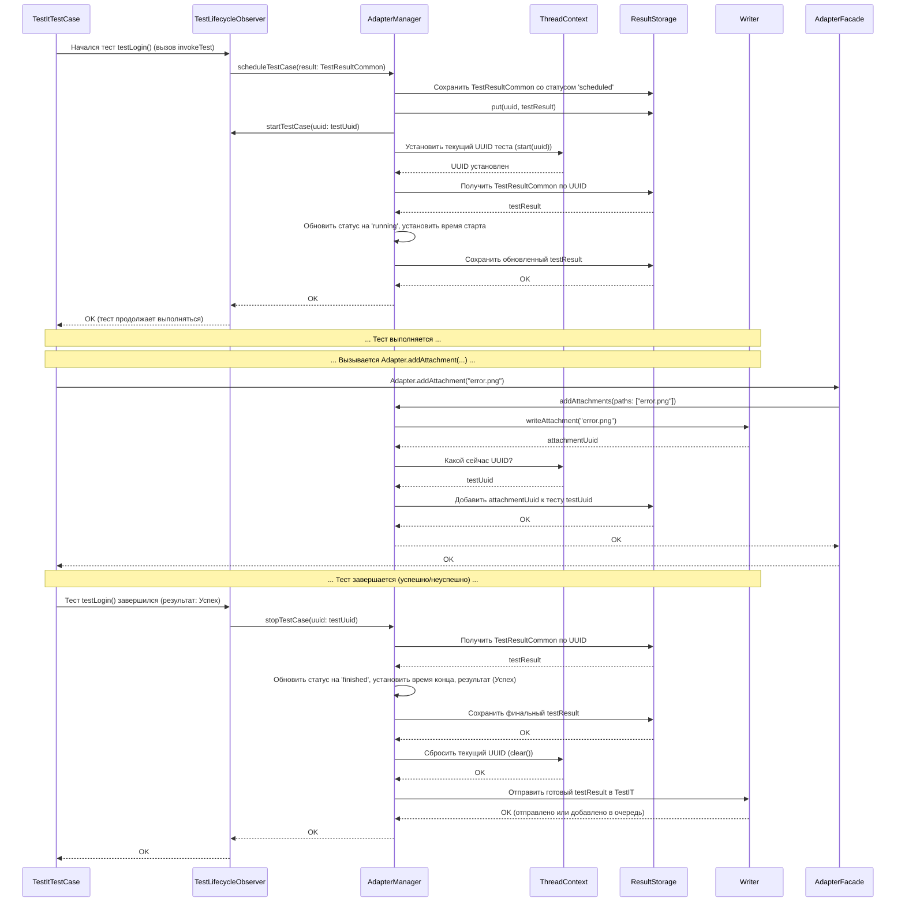

# Chapter 3: Менеджер Адаптера (AdapterManager)


В предыдущей главе, [Базовый Тестовый Класс (TestItTestCase)](02_базовый_тестовый_класс__testittestcase__.md), мы увидели, как специальный класс `TestItTestCase` помогает "подключить" наши тесты к адаптеру, автоматически сообщая о начале и конце каждого шага. Это как дать каждому поезду (тесту) на вокзале расписание и радио, чтобы он мог сообщать о своем движении.

Но кто же на вокзале управляет всем движением? Кто получает сообщения от поездов, знает об общем расписании, следит за тем, чтобы информация передавалась на табло (в TestIT), и координирует все службы? Именно эту роль и выполняет **Менеджер Адаптера (AdapterManager)**.

Представьте, что вы используете `TestItTestCase` для своих тестов. Вы видите, что результаты волшебным образом появляются в TestIT. Как это происходит? Кто решает, когда нужно *начать* весь тестовый запуск, когда его *закончить*? Кто знает, что тест `testLoginSuccess` только что начался, и ему нужно присвоить статус "выполняется"? Кто принимает команду "добавить скриншот ошибки" и передает ее куда нужно?

**Главная задача этой главы:** Понять, что такое `AdapterManager`, какие задачи он решает и как он координирует работу других частей адаптера.

## Что такое `AdapterManager`? Диспетчер вашего тестового вокзала

**Менеджер Адаптера (`AdapterManager`)** — это центральный компонент библиотеки `adapters-swift`, который отвечает за координацию всего процесса интеграции с TestIT. Это главный "дирижер" оркестра адаптера.

Думайте о нем как **о диспетчере на вокзале**:

*   **Знает общее расписание:** Он знает, когда начинается и заканчивается весь тестовый запуск (сессия тестирования).
*   **Управляет платформами:** Он управляет "контейнерами" — группами тестов (например, всеми тестами в одном классе). Он знает, когда начинается и заканчивается тестирование группы.
*   **Следит за поездами:** Он управляет жизненным циклом *каждого* отдельного теста — получает сигналы о его начале, конце, успехе или падении.
*   **Принимает сообщения:** Он получает команды, например, "добавить вложение (скриншот)" или "добавить ссылку" к текущему тесту.
*   **Координирует службы:** Он взаимодействует с другими компонентами:
    *   С [Конфигурацией Адаптера](01_конфигурация_адаптера_.md), чтобы знать настройки (куда подключаться, какой режим работы).
    *   С [Хранилищем Результатов (ResultStorage)](06_хранилище_результатов__resultstorage__.md), чтобы временно сохранять информацию о тестах перед отправкой.
    *   С [Отправщиком Результатов (Writer)](07_отправщик_результатов__writer___httpwriter__.md), чтобы передать ему готовые результаты для отправки в TestIT.
    *   С [Клиентом API TestIT (ApiClient)](08_клиент_api_testit__apiclient___tmsapiclient__.md) (через Writer или напрямую), чтобы взаимодействовать с сервером TestIT (например, создать новый тест-ран).
    *   С `ThreadContext` (внутренний компонент), чтобы знать, какой тест выполняется *в данный момент* в текущем потоке.
    *   С [Наблюдателем Жизненного Цикла Теста (TestLifecycleObserver)](04_наблюдатель_жизненного_цикла_теста__testlifecycleobserver__.md), чтобы получать сигналы от `TestItTestCase`.

Без `AdapterManager` адаптер был бы просто набором разрозненных инструментов. `AdapterManager` связывает их воедино и управляет всем процессом от начала до конца.

## Как `AdapterManager` используется (в основном, незаметно)

Хорошая новость для новичков: вам, скорее всего, **не придется напрямую вызывать методы `AdapterManager`** в ваших тестах. Он работает "за кулисами".

*   Класс [TestItTestCase](02_базовый_тестовый_класс__testittestcase__.md), от которого вы наследуетесь, уже знает, как общаться с `AdapterManager` (через [Наблюдателя Жизненного Цикла Теста (TestLifecycleObserver)](04_наблюдатель_жизненного_цикла_теста__testlifecycleobserver__.md)) и сообщать ему о событиях жизненного цикла теста.
*   Для простых действий, таких как добавление вложений или ссылок, адаптер предоставляет удобный фасад `Adapter`, который уже использует `AdapterManager` под капотом.

Например, когда вы пишете:

```swift
import SharedTestitLibrary

// ... внутри вашего тестового метода ...
Adapter.addAttachments(path: "/путь/к/скриншоту.png")
```

Этот простой вызов `Adapter.addAttachments` на самом деле делает следующее:

1.  `Adapter` получает экземпляр `AdapterManager` (используя `Adapter.getAdapterManager()`).
2.  `Adapter` вызывает метод `adapterManager.addAttachments(paths: ["/путь/к/скриншоту.png"])`.
3.  `AdapterManager` уже выполняет всю работу: определяет текущий тест, передает путь к файлу [Отправщику Результатов (Writer)](07_отправщик_результатов__writer___httpwriter__.md) для загрузки и связывает полученный ID вложения с текущим тестом в [Хранилище Результатов (ResultStorage)](06_хранилище_результатов__resultstorage__.md).

То есть, `AdapterManager` — это мощный двигатель, но обычно вы взаимодействуете с ним через более простую "педаль газа" (`Adapter`) или "руль" (`TestItTestCase`).

### Получение экземпляра `AdapterManager` (для продвинутых)

Хотя это редко нужно, вы *можете* получить доступ к `AdapterManager` напрямую, если вам нужна более сложная координация или вы создаете свои собственные интеграции. Используйте статический метод `Adapter.getAdapterManager()`:

```swift
import SharedTestitLibrary

// Получаем экземпляр менеджера
let manager = Adapter.getAdapterManager()

// Теперь можно вызывать его методы (если это действительно нужно)
// Например, узнать, какой тест выполняется сейчас
let currentTestUuid = manager.getCurrentTestCaseOrStep()
print("Текущий выполняющийся тест или шаг: \(currentTestUuid ?? "нет")")

// Или (гипотетический пример) запустить какой-то процесс в начале всех тестов
// manager.startTests() // Обычно это делается автоматически
```

**Пояснение:**
`Adapter.getAdapterManager()` возвращает *единственный* экземпляр `AdapterManager` на все время работы ваших тестов (это называется "синглтон" или "одиночка"). Он создается при первом обращении и затем используется повторно.

## Заглянем под капот: Как работает `AdapterManager`

Как же этот "диспетчер" координирует работу? Давайте рассмотрим ключевые моменты.

### 1. Инициализация: Сборка команды

Когда вы запускаете тесты и происходит первый вызов `Adapter.getAdapterManager()`, происходит процесс инициализации:

1.  **Загрузка Настроек:** Сначала загружается [Конфигурация Адаптера](01_конфигурация_адаптера_.md) с помощью `ConfigManager` (как мы видели в Главе 1).
2.  **Создание Зависимостей:** Создаются или получаются другие необходимые компоненты:
    *   `ApiClient`: Клиент для общения с TestIT API.
    *   `ResultStorage`: Хранилище для временного накопления результатов.
    *   `ThreadContext`: Для отслеживания текущего теста/шага.
    *   `ListenerManager`: Менеджер для обработки событий от `TestItTestCase`.
    *   `Writer`: Отправщик результатов в TestIT.
3.  **Создание `AdapterManager`:** Наконец, создается сам экземпляр `AdapterManager`, которому передаются все эти зависимости (компоненты). Это называется **внедрение зависимостей** — менеджер не создает свои инструменты сам, а получает их готовыми.

```swift
// Упрощенный пример инициализатора в AdapterManager.swift

// Все необходимые "инструменты" передаются снаружи
init(clientConfiguration: ClientConfiguration, // Настройки подключения
     adapterConfig: AdapterConfig,          // Настройки поведения
     client: ApiClient,                   // API клиент
     listenerManager: ListenerManager,      // Менеджер событий
     storage: ResultStorage,              // Хранилище результатов
     threadContext: ThreadContext,         // Контекст потока
     writer: Writer?) {                  // Отправщик (может быть nil)

    self.clientConfiguration = clientConfiguration
    self.adapterConfig = adapterConfig
    self.client = client
    self.listenerManager = listenerManager
    self.storage = storage
    self.threadContext = threadContext
    self.writer = writer
    // ... логирование начальных конфигураций ...
    Self.logger.debug("AdapterManager успешно инициализирован со всеми зависимостями.")
}
```

**Пояснение:** Этот код показывает, что `AdapterManager` при создании получает все необходимые ему для работы "инструменты" (конфигурацию, клиент API, хранилище и т.д.). Это делает его гибким и тестируемым.

### 2. Жизненный цикл теста: От старта до финиша

Давайте посмотрим, что делает `AdapterManager`, когда `TestItTestCase` сообщает о начале и конце теста.



**Ключевые шаги:**

*   **`scheduleTestCase` / `startTestCase`:** Когда тест вот-вот начнется, `AdapterManager` сначала сохраняет информацию о нем ([`TestResultCommon`](05_модель_результата_теста__testresultcommon__.md)) в [Хранилище Результатов (ResultStorage)](06_хранилище_результатов__resultstorage__.md) со статусом "запланирован" (`scheduled`). Затем, когда тест фактически стартует, он обновляет статус на "выполняется" (`running`), записывает время начала и запоминает UUID (уникальный идентификатор) этого теста в `ThreadContext`, чтобы знать, какой тест активен сейчас.
*   **`stopTestCase`:** Когда тест завершен, `AdapterManager` получает финальный результат (успех, падение и т.д.), обновляет информацию в `ResultStorage` (статус "завершен" (`finished`), время окончания), очищает `ThreadContext` и передает готовый объект `TestResultCommon` [Отправщику Результатов (Writer)](07_отправщик_результатов__writer___httpwriter__.md) для отправки в TestIT.
*   **`addAttachments`:** Во время выполнения теста, если вызывается `Adapter.addAttachments`, менеджер получает путь к файлу, использует `Writer` для загрузки файла (если нужно) и получения его ID, а затем обновляет *текущий* тест (UUID которого он берет из `ThreadContext`) в `ResultStorage`, добавляя туда ID вложения.

**Примеры кода из `AdapterManager.swift`:**

```swift
// Упрощенный метод начала теста в AdapterManager.swift
func startTestCase(uuid: String) {
    guard adapterConfig.shouldEnableTmsIntegration else { return } // Проверка настроек

    // Получаем объект теста из хранилища (он должен быть запланирован ранее)
    guard var testResult = storage.getTestResult(uuid) else {
        Self.logger.error("Не могу начать тест: \(uuid) не найден")
        return
    }

    // Устанавливаем статус и время начала
    testResult.setItemStage(stage: .running)
    testResult.start = Int64(Date().timeIntervalSince1970 * 1000) // Текущее время
    storage.put(uuid, testResult) // Сохраняем обновленный результат

    threadContext.start(uuid) // Запоминаем, что этот тест теперь выполняется

    Self.logger.debug("Начало тест-кейса \(uuid)")
}
```

```swift
// Упрощенный метод завершения теста в AdapterManager.swift
func stopTestCase(uuid: String) {
    guard adapterConfig.shouldEnableTmsIntegration else { return } // Проверка настроек

    // Получаем объект теста из хранилища
    guard var testResult = storage.getTestResult(uuid) else {
        Self.logger.error("Не могу остановить тест: \(uuid) не найден")
        return
    }

    // Уведомляем слушателей (если нужно что-то сделать перед финальным сохранением)
    listenerManager.beforeTestStop(testResult: testResult)

    // Устанавливаем финальный статус и время окончания
    testResult.setItemStage(stage: .finished)
    testResult.stop = Int64(Date().timeIntervalSince1970 * 1000) // Текущее время
    storage.put(uuid, testResult) // Сохраняем финальный результат

    threadContext.clear() // Забываем про этот тест в текущем потоке

    Self.logger.debug("Завершение тест-кейса \(uuid)")

    // Передаем результат отправщику
    writer?.writeTest(testResult)
}
```

**Пояснение:** Эти методы показывают, как `AdapterManager` манипулирует состоянием объекта `TestResultCommon`, сохраняет его в `ResultStorage`, использует `ThreadContext` для отслеживания текущего теста и передает данные `Writer`-у для отправки.

## Заключение

`AdapterManager` — это сердце адаптера `adapters-swift`. Он действует как главный координатор, управляя полным жизненным циклом тестового запуска, групп тестов и отдельных тестов. Он получает команды (например, "начать тест", "завершить тест", "добавить вложение") от других частей системы (таких как `TestItTestCase` через `TestLifecycleObserver` или фасад `Adapter`) и оркеструет взаимодействие между конфигурацией, хранилищем результатов, API-клиентом и отправщиком.

Хотя вы редко будете взаимодействовать с ним напрямую, понимание его роли помогает понять, как адаптер превращает события ваших тестов в готовые результаты в TestIT. Он — тот самый "диспетчер", который следит за порядком на вашем тестовом вокзале.

В следующей главе мы подробнее рассмотрим одного из ключевых помощников `AdapterManager` — [Наблюдателя Жизненного Цикла Теста (TestLifecycleObserver)](04_наблюдатель_жизненного_цикла_теста__testlifecycleobserver__.md), который непосредственно получает сигналы от `TestItTestCase`.

**Далее:** [Глава 4: Наблюдатель Жизненного Цикла Теста (TestLifecycleObserver)](04_наблюдатель_жизненного_цикла_теста__testlifecycleobserver__.md)

---

Generated by [AI Codebase Knowledge Builder](https://github.com/The-Pocket/Tutorial-Codebase-Knowledge)