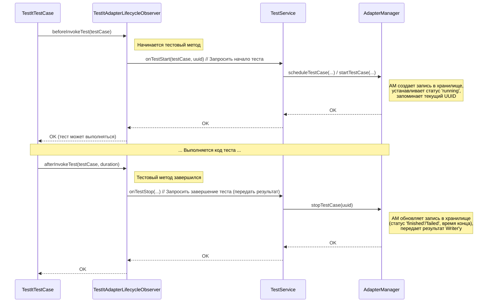

# Chapter 4: Наблюдатель Жизненного Цикла Теста (TestLifecycleObserver)


В предыдущей главе, [Менеджер Адаптера (AdapterManager)](03_менеджер_адаптера__adaptermanager__.md), мы узнали о главном координаторе адаптера — "диспетчере", который управляет всем процессом интеграции с TestIT. Мы поняли, что `AdapterManager` получает команды и данные о тестах и решает, что с ними делать.

Но *откуда* `AdapterManager` узнает, что конкретный тест только что начался? Или что метод `setUp` завершился? В [Главе 2: Базовый Тестовый Класс (TestItTestCase)](02_базовый_тестовый_класс__testittestcase__.md) мы видели, что `TestItTestCase` использует "свизлинг" для перехвата этих моментов. Но нужен кто-то, кто будет *слушать* эти сигналы от `TestItTestCase` и передавать их дальше, как реле.

**Проблема:** Нам нужен механизм, который будет "сидеть" рядом с `TestItTestCase`, ловить сигналы "тест начался", "setUp закончился", "тест упал" и немедленно сообщать об этом `AdapterManager` или другим службам адаптера, чтобы те могли выполнить нужные действия (например, обновить статус теста, записать время).

## Конвейер тестирования и его сенсоры: Введение в `TestLifecycleObserver`

Представьте себе конвейер на заводе, по которому движутся детали (ваши тесты). На разных этапах конвейера (подготовка setUp, выполнение теста, завершение tearDown) установлены сенсоры. Когда деталь проходит мимо сенсора, он срабатывает и посылает сигнал в центральную систему управления.

**`TestLifecycleObserver`** — это и есть такой набор "сенсоров" для ваших тестов. Это специальный компонент (а точнее, интерфейс и его реализация), который:
1.  **Слушает события:** Он получает уведомления от [TestItTestCase](02_базовый_тестовый_класс__testittestcase__.md) о ключевых моментах жизненного цикла теста (начало/конец `setUp`, `tearDown`, самого теста).
2.  **Реагирует:** При получении сигнала он выполняет определенные действия.
3.  **Передает команды:** Чаще всего, он передает команду [Менеджеру Адаптера (AdapterManager)](03_менеджер_адаптера__adaptermanager__.md) или связанным с ним службам (например, `TestService`), чтобы те обновили статус теста, записали время, подготовили данные для отправки и т.д.

**`TestItAdapterLifecycleObserver`** — это конкретная реализация ("модель сенсора"), которую использует адаптер `adapters-swift`. Именно она содержит логику, связывающую события жизненного цикла теста с действиями внутри адаптера.

## Как он используется? (Внутри `TestItTestCase`)

Для вас, как пользователя, `TestLifecycleObserver` в основном невидим. Вы не создаете его и не вызываете его методы напрямую в своих тестах. Этим занимается [TestItTestCase](02_базовый_тестовый_класс__testittestcase__.md).

Помните, в Главе 2 мы видели код `TestItTestCase`? Внутри него создается и используется экземпляр `TestItAdapterLifecycleObserver`:

```swift
// Упрощенный фрагмент из TestItTestCase.swift

open class TestItTestCase: XCTestCase {
    // ... (код свизлинга) ...

    // Экземпляр наблюдателя для этого теста
    private var lifecycleObserver: TestLifecycleObserver? = nil

    @objc func swizzled_setUp() {
        // Создаем наблюдателя, если его еще нет для этого экземпляра теста
        if (self.lifecycleObserver == nil) {
             // СОЗДАЕТСЯ: Используется конкретная реализация TestItAdapterLifecycleObserver
            self.lifecycleObserver = TestItAdapterLifecycleObserver()
        }
        print("[Lifecycle Event]: TestIt setUp started...")

        // ВЫЗЫВАЕТСЯ: Передаем сигнал "перед setUp" наблюдателю
        lifecycleObserver!.beforeSetup(testCase: self)

        // ... (вызов оригинального setUp) ...

        // ВЫЗЫВАЕТСЯ: Передаем сигнал "после setUp" наблюдателю
        lifecycleObserver!.afterSetup(testCase: self)
        print("[Lifecycle Event]: TestIt setUp completed...")
    }

    // Похожие вызовы lifecycleObserver есть в swizzled_tearDown и invokeTest
}
```

**Пояснение:**
Каждый раз, когда `TestItTestCase` перехватывает событие (например, начало `setUp`), он создает (если нужно) экземпляр `TestItAdapterLifecycleObserver` и вызывает у него соответствующий метод (`beforeSetup`, `afterSetup` и т.д.). Этот наблюдатель уже знает, что делать дальше – обычно, он обращается к [AdapterManager](03_менеджер_адаптера__adaptermanager__.md) или `TestService`.

## Ключевые обязанности: Что делает каждый "Сенсор"?

`TestLifecycleObserver` определяется как протокол (интерфейс) в Swift. Это означает, что он описывает *набор методов*, которые должен реализовать любой класс-"наблюдатель". Вот эти методы и их назначение в контексте `TestItAdapterLifecycleObserver`:

*   **`beforeSetup(testCase: XCTestCase)`:** Вызывается *перед* выполнением вашего кода в `setUp`.
    *   *Действие адаптера:* Обычно здесь могут инициализироваться какие-то структуры данных для теста, но часто основная логика происходит *после* `setUp`.
*   **`afterSetup(testCase: XCTestCase)`:** Вызывается *после* выполнения вашего кода в `setUp`.
    *   *Действие адаптера:* Если `setUp` провалился, адаптер может зафиксировать это и пометить тест как проваленный еще до его начала.
*   **`beforeInvokeTest(testCase: XCTestCase)`:** Вызывается *непосредственно перед* запуском вашего тестового метода (например, `testLoginSuccess`). Это очень важный момент!
    *   *Действие адаптера:* Именно здесь `TestItAdapterLifecycleObserver` обычно обращается к `TestService`, чтобы:
        *   Сгенерировать уникальный ID (UUID) для этого запуска теста.
        *   Создать запись о тесте в [Хранилище Результатов (ResultStorage)](06_хранилище_результатов__resultstorage__.md).
        *   Вызвать `AdapterManager.startTestCase`, чтобы пометить тест как "выполняется" (`running`) и записать время начала.
*   **`afterInvokeTest(testCase: XCTestCase, duration: TimeInterval)`:** Вызывается *сразу после* завершения вашего тестового метода.
    *   *Действие адаптера:* Здесь `TestItAdapterLifecycleObserver` (через `TestService` или напрямую вызывая `AdapterManager`) сообщает о завершении теста:
        *   Определяет результат теста (успех, падение, пропуск).
        *   Вызывает `AdapterManager.stopTestCase`, чтобы обновить статус теста (например, "завершен" (`finished`) или "провален" (`failed`)), записать время окончания и длительность.
        *   Передать готовый [результат теста](05_модель_результата_теста__testresultcommon__.md) [отправщику](07_отправщик_результатов__writer___httpwriter__.md).
*   **`beforeTeardown(testCase: XCTestCase)`:** Вызывается *перед* выполнением вашего кода в `tearDown`.
    *   *Действие адаптера:* Может использоваться для завершения каких-либо шагов теста, если они используются.
*   **`afterTeardown(testCase: XCTestCase)`:** Вызывается *после* выполнения вашего кода в `tearDown`.
    *   *Действие адаптера:* Окончательная очистка ресурсов, связанных с тестом, если это необходимо.

## Заглянем под капот: Как Наблюдатель передает сигнал?

Давайте посмотрим на упрощенную последовательность действий, когда начинается и заканчивается тестовый метод:



**Пояснение:**
Диаграмма показывает, что `TestItAdapterLifecycleObserver` (TLO) действует как посредник. Он получает событие от `TestItTestCase` (TTC) и вызывает соответствующие методы у `TestService` (TS), который, в свою очередь, использует `AdapterManager` (AM) для выполнения основной работы с состоянием теста и его результатом.

## Немного кода: Протокол и Реализация

Давайте посмотрим на ключевые файлы.

**1. Протокол `TestLifecycleObserver` (Файл `SharedTestitLibrary/TestLifecycleObserver.swift` или похожий)**

```swift
import Foundation
import XCTest

// Описание "контракта" для любого наблюдателя за жизненным циклом теста
public protocol TestLifecycleObserver {
    // Вызывается до/после setUp
    func beforeSetup(testCase: XCTestCase)
    func afterSetup(testCase: XCTestCase)

    // Вызывается до/после tearDown
    func beforeTeardown(testCase: XCTestCase)
    func afterTeardown(testCase: XCTestCase)

    // Вызывается до/после выполнения самого тестового метода (асинхронно)
    func beforeInvokeTest(testCase: XCTestCase) async
    func afterInvokeTest(testCase: XCTestCase, duration: TimeInterval)
}
```
**Пояснение:**
Этот код определяет, какие "сигналы" (`beforeSetup`, `afterInvokeTest` и т.д.) должен уметь обрабатывать любой наблюдатель. Слово `async` у `beforeInvokeTest` означает, что это действие может занять некоторое время (например, для связи с сервером), и тестовый фреймворк должен его подождать.

**2. Реализация `TestItAdapterLifecycleObserver` (Файл `SharedTestitLibrary/TestLifecycleObserver.swift` или похожий)**

```swift
import Foundation
import XCTest
import TestitApiClient // Импорт для доступа к компонентам адаптера

// Конкретная реализация наблюдателя для интеграции с TestIT
public class TestItAdapterLifecycleObserver: TestLifecycleObserver {

    // Зависимости: наблюдателю нужны другие части адаптера для работы
    private let adapterManager: AdapterManager
    private let executableTestService: ExecutableTestService // Служба для управления текущим тестом
    private let testService: TestService // Служба для старта/остановки тестов

    // Конструктор: получает нужные зависимости при создании
    public init() {
        // Получаем синглтон AdapterManager
        self.adapterManager = Adapter.getAdapterManager()

        // Создаем службы, передавая им нужные компоненты
        let threadLocalExecutableTest = ThreadLocal<ExecutableTest>()
        threadLocalExecutableTest.set(ExecutableTest()) // Инициализация контекста для потока
        self.executableTestService = ExecutableTestService(executableTest: threadLocalExecutableTest)
        self.testService = TestService(
            adapterManager: self.adapterManager,
            uuids: [:], // Может использоваться для связки ID
            isStepContainers: false,
            executableTestService: self.executableTestService
        )
        print("[Adapter Lifecycle]: Observer initialized.") // Лог инициализации
    }

    // --- Реализация методов протокола ---

    public func beforeSetup(testCase: XCTestCase) {
        print("[Adapter Event]: beforeSetup for \(testCase.name)")
        // Здесь могла бы быть логика, например, testService.onSetupStart(...)
    }

    public func afterSetup(testCase: XCTestCase) {
        print("[Adapter Event]: afterSetup for \(testCase.name)")
        // Здесь могла бы быть логика, например, testService.onSetupStop(...)
    }

    public func beforeTeardown(testCase: XCTestCase) {
        print("[Adapter Event]: beforeTeardown for \(testCase.name)")
        // Логика перед teardown
    }

    public func afterTeardown(testCase: XCTestCase) {
        print("[Adapter Event]: afterTeardown for \(testCase.name)")
        // Логика после teardown
    }

    // Асинхронный метод перед запуском теста
    public func beforeInvokeTest(testCase: XCTestCase) async {
        print("[Adapter Event]: beforeInvokeTest for \(testCase.name)")
        let testName = testCase.name // Получаем имя теста

        // Генерируем ID и создаем начальную запись для теста
        executableTestService.setTestStatus() // Подготовка контекста
        let uuid = executableTestService.getUuid() // Получаем UUID для этого теста
        print("[Adapter Logic]: Generated UUID: \(uuid ?? "nil")")

        // Вызываем TestService для регистрации начала теста
        // Передаем информацию о тесте и его UUID
        await testService.onTestStart(testCase: testCase, uuid: uuid ?? UUID().uuidString)
        print("[Adapter Logic]: Called testService.onTestStart")

        // Может также обновлять информацию о контейнере (классе тестов)
        let testNameHash = Utils.getHash(testName) // Хеш для идентификации класса/группы
         adapterManager.updateClassContainer(uuid: testNameHash) { container in
             if let validUUID = uuid {
                 container.children.append(validUUID) // Добавляем тест в его группу
             }
         }
        print("[Adapter Logic]: Finished updating container")
    }

    // Метод после завершения теста
    public func afterInvokeTest(testCase: XCTestCase, duration: TimeInterval) {
        print("[Adapter Event]: afterInvokeTest for \(testCase.name). Duration: \(duration)s")

        // Определяем финальный статус теста (прошел/упал)
        let status: AutoTestResultsForTestRunModel.Outcome // = ... определить статус ...
        if let lastFailure = testCase.testRun?.lastRespondedFailure {
            status = .failed
        } else {
             status = .passed
        }

        // Вызываем TestService для регистрации завершения теста
        testService.onTestStop(testCase: testCase, outcome: status, duration: duration)
        print("[Adapter Logic]: Called testService.onTestStop")

        // Здесь TestService внутри себя вызовет AdapterManager.stopTestCase(...)
        // для обновления данных в хранилище и отправки результатов.
    }
}
```
**Пояснение:**
Этот код показывает:
1.  `TestItAdapterLifecycleObserver` хранит ссылки на `AdapterManager` и другие службы (`TestService`, `ExecutableTestService`), которые он получает при инициализации.
2.  В методах (`beforeInvokeTest`, `afterInvokeTest` и т.д.) он вызывает методы этих служб, передавая им информацию о текущем тесте (`testCase`, `duration`, результат).
3.  Именно `TestService` и `AdapterManager` выполняют основную работу по созданию/обновлению записей о тестах, их хранению и подготовке к отправке. Наблюдатель лишь запускает этот процесс в нужный момент.

## Заключение

**Наблюдатель Жизненного Цикла Теста (`TestLifecycleObserver`)**, и его конкретная реализация **`TestItAdapterLifecycleObserver`**, играют ключевую роль связующего звена в адаптере `adapters-swift`. Они действуют как "сенсоры", которые:

*   Улавливают сигналы о событиях жизненного цикла теста от [TestItTestCase](02_базовый_тестовый_класс__testittestcase__.md).
*   Преобразуют эти сигналы в конкретные команды для других частей адаптера, в основном для `TestService` и [AdapterManager](03_менеджер_адаптера__adaptermanager__.md).
*   Инициируют такие действия, как запуск теста, остановка теста, запись времени и статуса.

Хотя вы не взаимодействуете с ним напрямую, понимание его роли помогает увидеть, как события в ваших тестах транслируются в действия внутри адаптера, которые в конечном итоге приводят к отправке результатов в TestIT.

Теперь, когда мы знаем, *когда* и *кто* собирает информацию о событиях теста, давайте посмотрим, *в каком формате* эта информация хранится перед отправкой.

**Далее:** [Глава 5: Модель Результата Теста (TestResultCommon)](05_модель_результата_теста__testresultcommon__.md)

---

Generated by [AI Codebase Knowledge Builder](https://github.com/The-Pocket/Tutorial-Codebase-Knowledge)