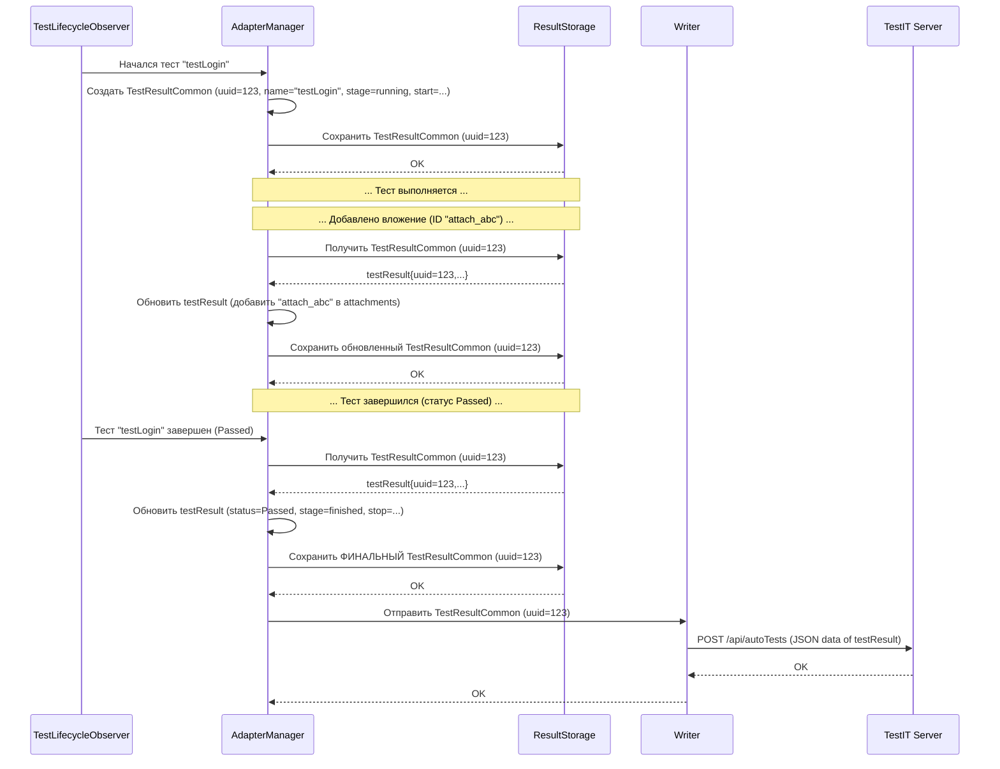

# Chapter 5: Модель Результата Теста (TestResultCommon)


В предыдущей главе, [Наблюдатель Жизненного Цикла Теста (TestLifecycleObserver)](04_наблюдатель_жизненного_цикла_теста__testlifecycleobserver__.md), мы разобрались, как адаптер "чувствует" моменты начала и конца наших тестов с помощью специальных "сенсоров". Эти сенсоры ловят сигналы и передают их [Менеджеру Адаптера (AdapterManager)](03_менеджер_адаптера__adaptermanager__.md), который, в свою очередь, дирижирует всем процессом.

Но когда тест выполняется, происходит много всего: он может пройти, упасть, оставить сообщение об ошибке, к нему могут быть прикреплены скриншоты или логи. Куда вся эта разнообразная информация складывается? Где она хранится в структурированном виде, прежде чем отправиться в TestIT?

**Проблема:** Нам нужен стандартизированный "контейнер" или "анкета", куда можно было бы аккуратно записать *всю* информацию об одном конкретном тестовом случае во время его выполнения.

## Что такое `TestResultCommon`? Анкета для вашего теста

**`TestResultCommon`** — это именно такая "анкета"! Это основная структура данных в `adapters-swift`, которая предназначена для хранения всей информации об одном тестовом запуске.

Представьте, что каждый ваш тест — это ученик, сдающий экзамен. `TestResultCommon` — это его личная карточка или подробный отчет об экзамене. По мере того как тест "сдает" свой экзамен (т.е. выполняется), эта карточка заполняется:

*   **Имя ученика (Имя теста):** `name`, `title`, `className` (например, "testSuccessfulLogin").
*   **Уникальный номер (ID):** `uuid` (уникальный идентификатор этого конкретного запуска), `externalId` (ID тест-кейса в TestIT).
*   **Оценка (Статус):** `itemStatus` (пройден (`Passed`), упал (`Failed`), пропущен (`Skipped`)).
*   **Время начала и конца:** `start`, `stop` (когда тест начался и закончился, в миллисекундах).
*   **Этапы выполнения (Стадии):** `itemStage` (запланирован (`scheduled`), выполняется (`running`), завершен (`finished`)).
*   **Комментарии учителя (Сообщения):** `message`, `description` (например, сообщение об ошибке).
*   **Прикрепленные работы (Вложения):** `attachments` (список ID скриншотов, логов и т.д.).
*   **Задания (Шаги):** `steps` (если тест состоит из нескольких шагов, здесь будет их список, каждый со своим результатом типа `StepResult`).
*   **Дополнительные пометки (Метки):** `labels` (например, `smoke`, `regression`).
*   **Связанные материалы (Ссылки):** `linkItems`, `resultLinks` (ссылки на задачи в Jira, документацию и т.д.).
*   **Информация об ошибке:** `throwable` (детали возникшей ошибки, если тест упал).
*   **Параметры запуска:** `parameters` (если тест параметризованный).
*   **Служебная информация:** `workItemIds` (ID связанных рабочих элементов в TestIT), `automaticCreationTestCases` (флаг из настроек).

`TestResultCommon` собирает все эти кусочки информации в одном месте. Затем эта "анкета" передается другим компонентам адаптера, таким как [Хранилище Результатов (ResultStorage)](06_хранилище_результатов__resultstorage__.md) и [Отправщик Результатов (Writer)](07_отправщик_результатов__writer___httpwriter__.md), которые уже знают, как ее сохранить и отправить в TestIT.

## Как используется `TestResultCommon`? (Внутренняя кухня адаптера)

В большинстве случаев вам **не нужно вручную создавать или изменять объекты `TestResultCommon`**. Это происходит автоматически внутри адаптера:

1.  **Создание:** Когда [Наблюдатель Жизненного Цикла Теста (TestLifecycleObserver)](04_наблюдатель_жизненного_цикла_теста__testlifecycleobserver__.md) получает сигнал о начале теста (например, через `beforeInvokeTest`), он сообщает об этом [Менеджеру Адаптера (AdapterManager)](03_менеджер_адаптера__adaptermanager__.md).
2.  **Инициализация:** `AdapterManager` создает новый объект `TestResultCommon`, присваивает ему уникальный `uuid`, заполняет начальные поля (имя теста, `externalId`, если известен) и устанавливает статус `scheduled` или `running`.
3.  **Сохранение:** Этот свежий объект `TestResultCommon` помещается в [Хранилище Результатов (ResultStorage)](06_хранилище_результатов__resultstorage__.md).
4.  **Обновление:** По мере выполнения теста (например, при добавлении вложения через `Adapter.addAttachments` или при завершении теста) `AdapterManager` извлекает соответствующий `TestResultCommon` из хранилища, обновляет его (добавляет ID вложения, устанавливает финальный статус `Passed`/`Failed`, время окончания `stop` и т.д.) и сохраняет обратно.
5.  **Отправка:** Когда тест полностью завершен, финальный объект `TestResultCommon` передается [Отправщику Результатов (Writer)](07_отправщик_результатов__writer___httpwriter__.md) для отправки в TestIT.

Таким образом, `TestResultCommon` — это как черновик отчета, который постепенно заполняется во время теста, а в конце становится финальной версией.

## Заглянем под капот: Структура данных

`TestResultCommon` — это структура (`struct`) в Swift. Она и связанные с ней типы данных объявлены как `Codable`. Это очень важно, потому что `Codable` позволяет легко преобразовывать эти объекты в формат JSON (текстовый формат для обмена данными) и обратно. Именно в виде JSON результаты тестов отправляются на сервер TestIT.

Давайте посмотрим на упрощенную структуру `TestResultCommon` и связанных с ней типов данных (на основе предоставленных файлов):

**1. `TestResultCommon.swift`**

```swift
import Foundation

struct TestResultCommon: Codable { // Codable для преобразования в/из JSON
    var uuid: String? = nil            // Уникальный ID запуска теста
    var externalId: String = ""        // ID тест-кейса в TestIT
    var workItemIds: [String] = []     // ID связанных задач
    var className: String = ""         // Имя класса теста
    var name: String = ""              // Имя тестового метода
    var title: String = ""             // Заголовок теста (может отличаться от имени)
    var message: String = ""           // Сообщение (часто для ошибки)
    var description: String = ""       // Описание теста
    var start: Int64 = 0               // Время старта (Unix timestamp в мс)
    var stop: Int64 = 0                // Время окончания (Unix timestamp в мс)
    var itemStatus: ItemStatus? = nil  // Финальный статус (Passed, Failed...)
    var itemStage: ItemStage? = nil    // Текущая стадия (Running, Finished...)
    var labels: [Label] = []           // Метки/теги
    var linkItems: [LinkItem] = []     // Ссылки (на баги, требования...)
    var attachments: [String] = []     // Список ID вложений (файлов)
    var steps: [StepResult] = []       // Список шагов теста
    var parameters: [String: String] = [:] // Параметры теста
    var throwable: Error? = nil        // Информация об ошибке (не всегда Codable)

    // ... другие поля и методы ...

    // Метод для обновления стадии
    mutating func setItemStage(stage: ItemStage) {
        self.itemStage = stage
    }

    // Метод для получения шагов
    func getSteps() -> [StepResult] {
        return steps
    }

    // Метод для установки шагов
    mutating func setSteps(steps: [StepResult]) {
        self.steps = steps
    }
}
```

**Пояснение:**
Этот код показывает основные поля структуры `TestResultCommon`. Мы видим поля для идентификаторов (`uuid`, `externalId`), имен (`className`, `name`), временных меток (`start`, `stop`), статуса и стадии (`itemStatus`, `itemStage`), а также списки для меток, ссылок, вложений и шагов. Обратите внимание на `Codable` — это позволяет легко "упаковать" этот объект для отправки по сети.

**2. Связанные типы данных:**

Для полей `itemStatus`, `itemStage`, `labels`, `linkItems`, `steps` используются другие структуры и перечисления (enums):

*   **`ItemStatus.swift` (Статус)**: Определяет возможные финальные результаты теста.
    ```swift
    // Возможные статусы завершения теста
    enum ItemStatus: String, Codable {
        case passed = "Passed"     // Пройден
        case failed = "Failed"     // Упал
        case skipped = "Skipped"   // Пропущен
        case inProgress = "InProgress" // В процессе (редко используется как финальный)
        case blocked = "Blocked"   // Заблокирован
    }
    ```
*   **`ItemStage.swift` (Стадия)**: Определяет текущее состояние теста в процессе выполнения.
    ```swift
    // Возможные стадии жизненного цикла теста/шага
    enum ItemStage: String, Codable {
        case scheduled = "scheduled" // Запланирован (еще не начался)
        case running = "running"     // Выполняется
        case finished = "finished"   // Завершен (успешно или нет)
        case pending = "pending"     // Ожидает (например, шаги внутри теста)
    }
    ```
*   **`Label.swift` (Метка)**: Простая структура для хранения имени метки.
    ```swift
    // Метка (тег) для теста
    struct Label: Codable {
        var name: String? // Имя метки, например, "smoke"
    }
    ```
*   **`LinkItem.swift` (Ссылка)**: Хранит информацию о ссылке (URL, название, тип).
    ```swift
    // Ссылка, связанная с тестом
    struct LinkItem: Codable {
        var title: String       // Название ссылки
        var url: String         // Адрес URL
        var description: String // Описание
        var type: LinkType      // Тип ссылки (например, Defect, Requirement) - LinkType не показан
    }
    ```
*   **`StepResult.swift` (Результат Шага)**: Если тест разбит на шаги, каждый шаг имеет свою `StepResult`. Обратите внимание, `StepResult` очень похож на `TestResultCommon`, но для шага. Он может содержать свои вложения, ссылки и даже вложенные шаги!
    ```swift
    // Результат выполнения одного шага теста
    struct StepResult: Codable {
        var name: String?                 // Название шага
        var itemStatus: ItemStatus?       // Статус шага (Passed, Failed...)
        var itemStage: ItemStage?         // Стадия шага (Running, Finished...)
        var description: String?          // Описание шага
        var start: Int64? = nil           // Время начала шага
        var stop: Int64? = nil            // Время окончания шага
        var attachments: [String] = []    // Вложения, относящиеся к шагу
        var linkItems: [LinkItem] = []    // Ссылки, относящиеся к шагу
        var steps: [StepResult] = []      // Вложенные шаги (если есть)
        var parameters: [String: String] = [:] // Параметры шага
        // ... другие поля ...
    }
    ```

**Пояснение:**
Эти вспомогательные структуры и перечисления делают модель `TestResultCommon` более организованной. Они позволяют четко определить возможные статусы и стадии, а также структурировать списки меток, ссылок и шагов. Все они также `Codable`, что обеспечивает их легкую сериализацию в JSON вместе с основным объектом `TestResultCommon`.

## Путешествие `TestResultCommon`

Давайте представим путь одного объекта `TestResultCommon`:



**Пояснение:**
Эта диаграмма показывает, как объект `TestResultCommon` создается `AdapterManager` при старте теста, сохраняется в `ResultStorage`, обновляется во время выполнения (например, при добавлении вложения) и, наконец, после завершения теста передается `Writer` для отправки в TestIT в виде JSON.

## Заключение

**Модель Результата Теста (`TestResultCommon`)** — это центральная структура данных в `adapters-swift`. Она служит универсальной "анкетой" или "карточкой отчета" для каждого тестового запуска, собирая всю необходимую информацию: от имени и статуса до шагов, вложений и ссылок.

*   Она создается и обновляется автоматически компонентами адаптера, такими как [AdapterManager](03_менеджер_адаптера__adaptermanager__.md).
*   Она использует вспомогательные типы (`ItemStatus`, `ItemStage`, `StepResult` и др.) для структурирования данных.
*   Благодаря `Codable`, она легко преобразуется в JSON для отправки в TestIT.

Понимание структуры `TestResultCommon` помогает лучше представить, какие именно данные адаптер собирает о ваших тестах и отправляет в систему управления тестированием.

Теперь, когда мы знаем, *что* хранится, давайте посмотрим, *где* эти `TestResultCommon` объекты временно находятся перед отправкой.

**Далее:** [Глава 6: Хранилище Результатов (ResultStorage)](06_хранилище_результатов__resultstorage__.md)

---

Generated by [AI Codebase Knowledge Builder](https://github.com/The-Pocket/Tutorial-Codebase-Knowledge)