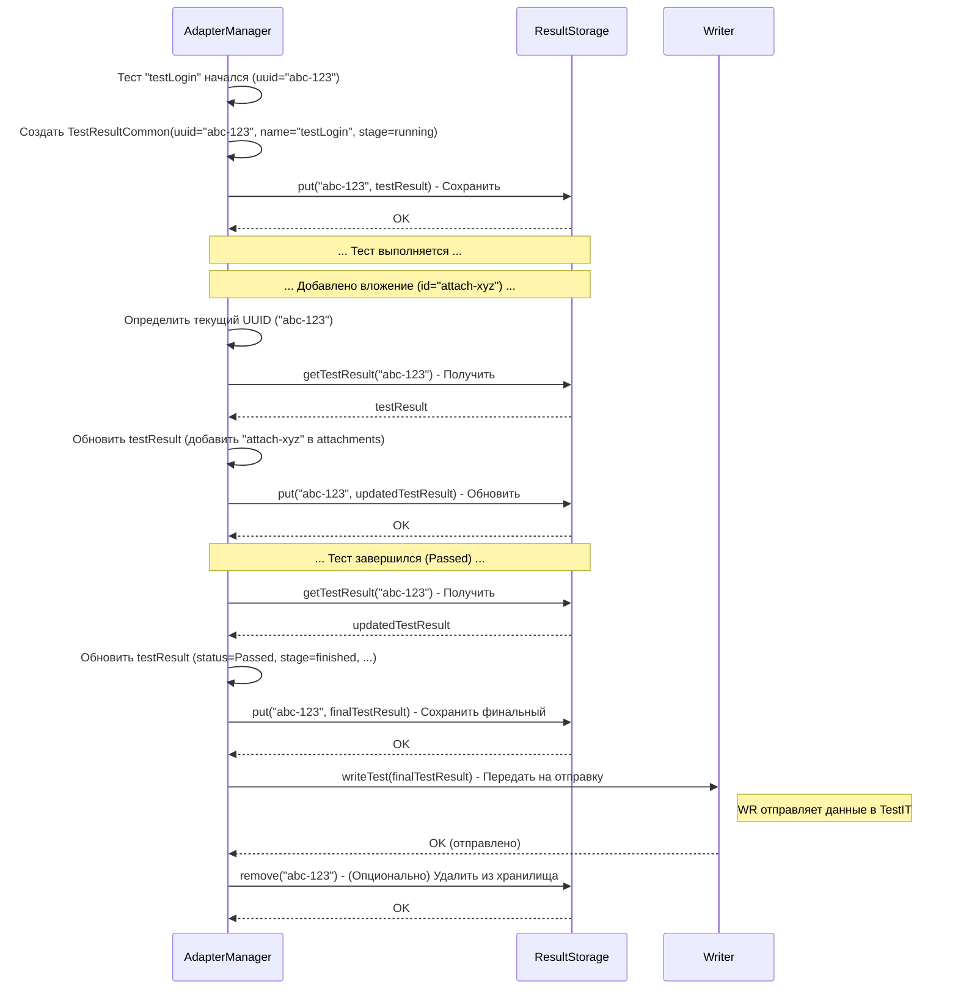

# Chapter 6: Хранилище Результатов (ResultStorage)


В предыдущей главе, [Модель Результата Теста (TestResultCommon)](05_модель_результата_теста__testresultcommon__.md), мы подробно рассмотрели "анкету" — структуру `TestResultCommon`, которая собирает всю информацию о выполнении одного теста: его имя, статус, время, шаги, вложения и многое другое. Мы узнали, *что* именно адаптер собирает.

Но *где* эти "анкеты" хранятся, пока тест еще идет? Представьте, тест начался, создался объект `TestResultCommon`. Затем пользователь добавляет скриншот — нужно обновить этот объект. Потом тест завершается — снова нужно обновить. Информация накапливается постепенно. Где находится это временное место, где все эти данные ждут своей отправки в TestIT?

**Проблема:** Нам нужно безопасное и доступное место внутри адаптера, где можно временно хранить и обновлять информацию о тестах, шагах, группах тестов (контейнерах) и подготовительных методах (фикстурах) *во время их выполнения*. Это место должно позволять разным частям адаптера (например, компоненту, отслеживающему начало теста, и компоненту, добавляющему вложение) работать с *одними и теми же* данными для текущего теста.

## Что такое `ResultStorage`? Оперативный склад для данных теста

**Хранилище Результатов (`ResultStorage`)** — это и есть то самое временное хранилище. Представьте его как **оперативный склад** на заводе или **черновик** для записей.

*   **Оперативный склад:** Пока идет "сборка" (выполнение теста), все необходимые "детали" (информация из `TestResultCommon`, данные о шагах, контейнерах) временно складываются сюда. Они под рукой, к ним легко получить доступ из разных "цехов" (частей адаптера).
*   **Черновик:** Информация о тесте записывается сюда по мере поступления. Начался тест — сделали запись. Добавили скриншот — дописали в нужную строку. Тест упал — отметили статус "Провален".

**Главная задача `ResultStorage`:** Обеспечить временное, централизованное хранение объектов [TestResultCommon](05_модель_результата_теста__testresultcommon__.md), `StepResult`, `FixtureResult`, `MainContainer`, `ClassContainer` и других во время тестового запуска. Это позволяет адаптеру накапливать информацию о тесте по частям и иметь к ней доступ из разных мест, прежде чем она будет окончательно сформирована и отправлена.

Каждый элемент в хранилище обычно идентифицируется уникальным **UUID** (уникальным идентификатором).

## Как используется `ResultStorage`? (В основном, незаметно)

Для вас, как для пользователя, пишущего тесты, `ResultStorage` — это компонент, работающий **"за кулисами"**. Вам не нужно напрямую вызывать его методы.

Кто же его использует? В основном, это:

1.  **[Менеджер Адаптера (AdapterManager)](03_менеджер_адаптера__adaptermanager__.md):**
    *   Когда тест начинается, `AdapterManager` создает объект [`TestResultCommon`](05_модель_результата_теста__testresultcommon__.md) и **помещает** его в `ResultStorage` с помощью метода `put`.
    *   Когда нужно добавить вложение или ссылку, `AdapterManager` **получает** текущий `TestResultCommon`/`StepResult` из `ResultStorage` по его UUID (используя метод `get`), обновляет его и **сохраняет** обратно (снова через `put`).
    *   Когда тест или шаг завершается, `AdapterManager` снова **получает** объект, обновляет его финальным статусом и временем, **сохраняет** и передает [Отправщику Результатов](07_отправщик_результатов__writer___httpwriter__.md) (или `Writer` сам забирает данные из `ResultStorage`).
2.  **[Отправщик Результатов (Writer / HttpWriter)](07_отправщик_результатов__writer___httpwriter__.md):**
    *   Перед отправкой данных в TestIT, `Writer` может **получить** необходимые объекты (например, `TestResultCommon` или контейнеры) из `ResultStorage`, чтобы сформировать правильный JSON-запрос к API TestIT.

Таким образом, `ResultStorage` — это внутренний механизм адаптера, обеспечивающий сохранность данных во время выполнения.

## Заглянем под капот: Как работает Хранилище?

Давайте представим типичный сценарий работы с `ResultStorage`:

1.  **Начало теста:** `AdapterManager` получает сигнал о начале теста `testLogin`. Он создает объект `TestResultCommon` для этого теста с уникальным `uuid` = "abc-123" и статусом "running".
2.  **Сохранение:** `AdapterManager` вызывает `storage.put("abc-123", testResultObject)`. `ResultStorage` сохраняет этот объект у себя, ассоциируя его с ключом "abc-123".
3.  **Добавление вложения:** Во время теста вызывается `Adapter.addAttachments`. `AdapterManager` определяет текущий UUID ("abc-123"). Он вызывает `storage.getTestResult("abc-123")`, чтобы получить объект `TestResultCommon`.
4.  **Обновление:** `AdapterManager` добавляет ID нового вложения в поле `attachments` полученного объекта.
5.  **Повторное сохранение:** `AdapterManager` вызывает `storage.put("abc-123", updatedTestResultObject)`, чтобы перезаписать старую версию объекта обновленной.
6.  **Завершение теста:** Тест завершается успешно. `AdapterManager` вызывает `storage.getTestResult("abc-123")`, устанавливает `itemStatus = .passed`, `itemStage = .finished`, время `stop`, и снова вызывает `storage.put("abc-123", finalTestResultObject)`.
7.  **Отправка:** `AdapterManager` передает финальный `finalTestResultObject` компоненту `Writer`, который отправит его в TestIT. `Writer` может также сам запросить объект из `storage`, если это предусмотрено его логикой.
8.  **(Опционально) Очистка:** После успешной отправки или по завершении всего тест-рана, записи из `ResultStorage` могут удаляться с помощью метода `remove`, чтобы освободить память.

Вот как это может выглядеть на диаграмме:



### Реализация: Протокол и Пример Хранилища в Памяти

В `adapters-swift` `ResultStorage` определен как **протокол** (интерфейс). Это значит, что он описывает *требования* к любому классу, который хочет быть хранилищем, но не диктует, *как именно* хранить данные.

**1. Протокол `ResultStorage.swift` (Упрощенно)**

```swift
// Протокол, описывающий, что должно уметь хранилище
protocol ResultStorage {
    // Положить объект в хранилище по ключу UUID
    func put(_ uuid: String, _ value: Any) // Используем Any для гибкости

    // Удалить объект из хранилища по UUID
    func remove(_ uuid: String)

    // Получить конкретные типы объектов по UUID (возвращают Optional)
    func getTestsContainer(_ uuid: String) -> MainContainer?
    func getClassContainer(_ uuid: String) -> ClassContainer?
    func getTestResult(_ uuid: String) -> TestResultCommon?
    func getFixture(_ uuid: String) -> FixtureResult?
    func getStep(_ uuid: String) -> StepResult?

    // Получить список вложений для объекта
    func getAttachmentsList(_ uuid: String) -> [String]?
    // Обновить список вложений для объекта
    func updateAttachmentsList(_ uuid: String, adding newAttachments: [String])
}
```

**Пояснение:**
Протокол определяет основные операции: `put` (положить/обновить), `remove` (удалить), и несколько `get...` методов для получения объектов разных типов (тест, шаг, контейнер и т.д.). Использование `Any` в `put` позволяет хранить объекты разных типов, но требует проверки типа при извлечении (что делают `get...` методы).

**2. Реализация `InMemoryResultStorage.swift` (Упрощенный Пример)**

Библиотека `adapters-swift` предоставляет простую реализацию этого протокола, которая хранит все данные **в оперативной памяти** с использованием словаря (Dictionary).

```swift
import Foundation

// Простая реализация хранилища, использующая словарь в памяти
// ВАЖНО: Эта реализация НЕ является потокобезопасной сама по себе!
// В реальном коде используется NSLock для базовой синхронизации.
class InMemoryResultStorage: ResultStorage {
    // Основной словарь [UUID: Объект] для хранения всего
    private var storage: [String: Any] = [:]
    // Отдельный словарь для списков вложений (для удобства обновления)
    private var attachmentLists: [String: [String]] = [:]
    // Блокировка для обеспечения базовой потокобезопасности
    private let lock = NSLock()

    func put(_ uuid: String, _ value: Any) {
        lock.lock() // Захватываем блокировку перед изменением
        defer { lock.unlock() } // Гарантируем освобождение блокировки
        storage[uuid] = value
        // Дополнительная логика для attachmentLists, если нужно
    }

    func remove(_ uuid: String) {
        lock.lock()
        defer { lock.unlock() }
        storage.removeValue(forKey: uuid)
        attachmentLists.removeValue(forKey: uuid) // Удаляем и из списков вложений
    }

    // Пример метода get...
    func getTestResult(_ uuid: String) -> TestResultCommon? {
        lock.lock()
        defer { lock.unlock() }
        // Пытаемся привести значение из словаря к типу TestResultCommon
        return storage[uuid] as? TestResultCommon
    }

    // Пример метода обновления списка вложений
    func updateAttachmentsList(_ uuid: String, adding newAttachments: [String]) {
        lock.lock()
        defer { lock.unlock() }
        // Пытаемся найти и обновить существующий список вложений
        if var existingList = storage[uuid] as? TestResultCommon {
             existingList.attachments.append(contentsOf: newAttachments)
             storage[uuid] = existingList // Сохраняем обновленный объект TestResultCommon
        } else if var existingStep = storage[uuid] as? StepResult {
             existingStep.attachments.append(contentsOf: newAttachments)
             storage[uuid] = existingStep // Сохраняем обновленный объект StepResult
        } else {
             // Логика обработки, если объект не найден или не имеет поля attachments
             print("Предупреждение: Не удалось добавить вложения для UUID: \(uuid)")
        }
    }

    // ... Реализация других методов get... (аналогично getTestResult) ...
    func getTestsContainer(_ uuid: String) -> MainContainer? { /* ... as? MainContainer */ return nil }
    func getClassContainer(_ uuid: String) -> ClassContainer? { /* ... as? ClassContainer */ return nil }
    func getFixture(_ uuid: String) -> FixtureResult? { /* ... as? FixtureResult */ return nil }
    func getStep(_ uuid: String) -> StepResult? { /* ... as? StepResult */ return nil}
    func getAttachmentsList(_ uuid: String) -> [String]? { /* ... */ return nil }
}
```

**Пояснение:**
Эта реализация использует обычный Swift-словарь `storage` для хранения пар "UUID - Объект". Метод `put` добавляет или обновляет запись, `remove` удаляет ее, а `get...` методы пытаются извлечь запись и привести ее к нужному типу (`as? TestResultCommon`). `NSLock` используется для предотвращения проблем при одновременном доступе из разных потоков (что важно, так как тесты могут выполняться параллельно). Метод `updateAttachmentsList` показывает, как хранилище может инкапсулировать логику обновления конкретных полей объекта.

### Использование `ResultStorage` в `AdapterManager`

Давайте посмотрим, как `AdapterManager` использует этот `storage`.

```swift
// Упрощенный фрагмент из AdapterManager.swift

class AdapterManager {
    // ... другие свойства ...
    private var storage: ResultStorage // Менеджер хранит ссылку на хранилище
    private var threadContext: ThreadContext // Для получения текущего UUID
    private let lock = NSLock() // Для синхронизации доступа

    // Инициализатор получает хранилище при создании
    init(..., storage: ResultStorage, ...) {
        self.storage = storage
        // ...
    }

    // Пример: Начало тест-кейса
    func startTestCase(uuid: String) {
        // ...
        guard var testResult = storage.getTestResult(uuid) else {
            // Обработка ошибки: тест не найден в хранилище
            return
        }
        // Обновляем объект
        testResult.setItemStage(stage: .running)
        testResult.start = /* ... текущее время ... */
        storage.put(uuid, testResult) // Сохраняем обновленный объект обратно
        // ...
        threadContext.start(uuid) // Запоминаем текущий UUID
        // ...
    }

    // Пример: Добавление вложений
    func addAttachments(paths attachmentPaths: [String]) {
        // ... (логика загрузки файлов и получения их ID через Writer)
        let attachmentUuids: [String] = /* ... ID загруженных файлов ... */

        guard let currentUuid = threadContext.getCurrent() else {
             // Обработка ошибки: нет текущего теста/шага
             return
        }

        // Используем специализированный метод хранилища для обновления списка
        storage.updateAttachmentsList(currentUuid, adding: attachmentUuids)
         Self.logger.debug("Добавлены вложения \(attachmentUuids) к элементу \(currentUuid)")
    }

    // Пример: Остановка тест-кейса
    func stopTestCase(uuid: String) {
        // ...
        guard var testResult = storage.getTestResult(uuid) else {
             // Обработка ошибки
             return
        }
        // Финальное обновление объекта
        testResult.setItemStage(stage: .finished)
        testResult.stop = /* ... текущее время ... */
        // Установка статуса (Passed/Failed) происходит до вызова stopTestCase
        storage.put(uuid, testResult) // Сохраняем финальную версию

        threadContext.clear() // Очищаем текущий контекст
        
        writer?.writeTest(testResult) // Передаем финальный объект отправщику
        // ...
    }
}
```

**Пояснение:**
Эти фрагменты показывают типичный цикл взаимодействия `AdapterManager` с `ResultStorage`: получить объект (`get`), изменить его, сохранить обратно (`put`). Для добавления вложений используется метод `updateAttachmentsList`, который инкапсулирует логику обновления списка внутри самого хранилища. `AdapterManager` также использует `ThreadContext` для определения UUID текущего активного элемента (теста или шага), к которому нужно применить изменения.

## Заключение

**Хранилище Результатов (`ResultStorage`)** — это незаметный, но важный компонент `adapters-swift`. Он служит временным "оперативным складом" или "черновиком", где [`AdapterManager`](03_менеджер_адаптера__adaptermanager__.md) хранит и обновляет объекты [`TestResultCommon`](05_модель_результата_теста__testresultcommon__.md) и связанные с ними данные (шаги, контейнеры) во время выполнения тестов.

*   Оно предоставляет простой интерфейс (протокол) для сохранения (`put`), получения (`get`) и удаления (`remove`) данных по UUID.
*   Стандартная реализация (`InMemoryResultStorage`) использует словарь в памяти и базовую потокобезопасность.
*   Вы, как пользователь, обычно не взаимодействуете с ним напрямую.

Понимание роли `ResultStorage` помогает составить полную картину того, как адаптер собирает, временно хранит и подготавливает данные о ваших тестах перед их окончательной отправкой.

Теперь, когда данные собраны и временно сохранены в `ResultStorage`, как они попадают в TestIT? Об этом мы поговорим в следующей главе.

**Далее:** [Глава 7: Отправщик Результатов (Writer / HttpWriter)](07_отправщик_результатов__writer___httpwriter__.md)

---

Generated by [AI Codebase Knowledge Builder](https://github.com/The-Pocket/Tutorial-Codebase-Knowledge)