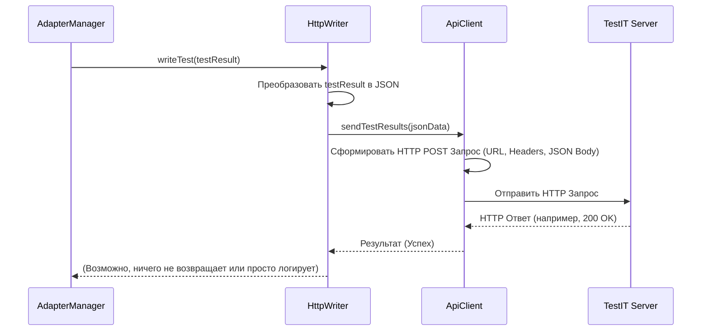
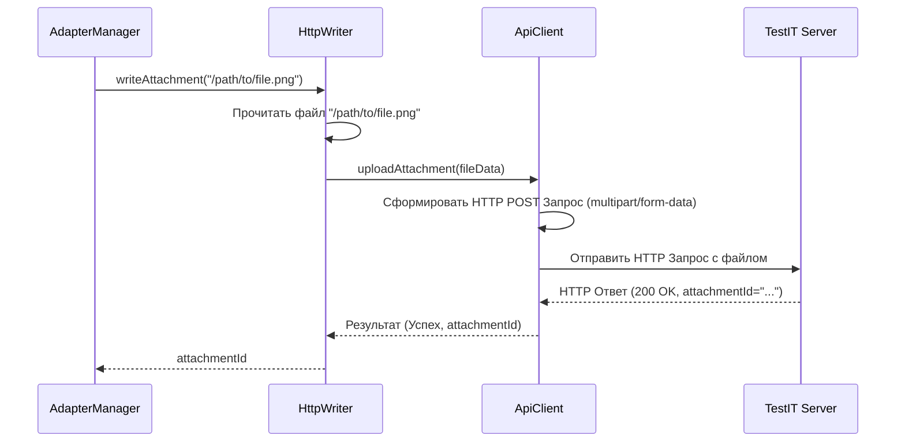

# Chapter 7: Отправщик Результатов (Writer / HttpWriter)


В предыдущей главе, [Хранилище Результатов (ResultStorage)](06_хранилище_результатов__resultstorage__.md), мы узнали о временном "складе", где адаптер накапливает всю информацию о проходящих тестах ([TestResultCommon](05_модель_результата_теста__testresultcommon__.md), шаги, вложения) прежде, чем она будет готова к отправке. Мы разобрались, *где* хранятся данные.

Но как эти собранные и сохраненные данные — готовые "анкеты" тестов — доставляются по адресу, то есть в систему TestIT? Кто берет эти данные со "склада" и отправляет их на сервер?

**Проблема:** Нам нужен компонент, который возьмет на себя финальную задачу: забрать подготовленные результаты тестов, контейнеры и вложения из [Хранилища Результатов (ResultStorage)](06_хранилище_результатов__resultstorage__.md) и надежно отправить их на сервер TestIT через сеть.

## Что такое `Writer`? Почтальон для ваших тестов

**Отправщик Результатов (`Writer`)** — это именно тот компонент, который отвечает за доставку. Представьте его как **почтальона** для ваших тестов:

*   Он приходит на "склад" ([ResultStorage](06_хранилище_результатов__resultstorage__.md)).
*   [Менеджер Адаптера (AdapterManager)](03_менеджер_адаптера__adaptermanager__.md) говорит ему: "Вот готовая анкета теста (объект `TestResultCommon`) — доставь ее!". Или "Вот этот файл (вложение) — загрузи его".
*   "Почтальон" (`Writer`) берет эти "посылки" и использует "транспорт" ([Клиент API TestIT (ApiClient)](08_клиент_api_testit__apiclient___tmsapiclient__.md)) для отправки их по нужному адресу — на ваш сервер TestIT.

**Главная задача `Writer`:** Быть последним звеном в цепочке, отвечающим за фактическую отправку накопленных данных в TestIT по сети.

В `adapters-swift` эта концепция реализована через:

1.  **Протокол `Writer`:** Это как должностная инструкция для почтальона. Она определяет, *какие* задачи должен выполнять отправщик: "уметь отправить результат теста", "уметь отправить результат контейнера", "уметь загрузить вложение".
2.  **Реализация `HttpWriter`:** Это конкретный "сотрудник", который выполняет эту работу. `HttpWriter` реализует все требования протокола `Writer`, используя [ApiClient](08_клиент_api_testit__apiclient___tmsapiclient__.md) для взаимодействия с TestIT сервером по протоколу HTTP(S).

## Как используется `Writer`? (Под капотом `AdapterManager`)

Как и [ResultStorage](06_хранилище_результатов__resultstorage__.md), `Writer` в основном используется **внутренними компонентами адаптера**, главным образом — [Менеджером Адаптера (AdapterManager)](03_менеджер_адаптера__adaptermanager__.md). Вам редко придется вызывать его методы напрямую.

Вот типичный сценарий:

1.  Тест завершается. `AdapterManager` обновляет финальный статус и время в объекте [TestResultCommon](05_модель_результата_теста__testresultcommon__.md) внутри [ResultStorage](06_хранилище_результатов__resultstorage__.md).
2.  `AdapterManager` решает, что этот результат готов к отправке.
3.  Он вызывает соответствующий метод у `Writer`, который был создан и передан `AdapterManager`-у при инициализации. Например: `writer.writeTest(finalTestResult)`.
4.  Точно так же, когда нужно загрузить вложение (например, через `Adapter.addAttachments`), `AdapterManager` вызывает `writer.writeAttachment(path)` и получает обратно ID загруженного файла.

**Пример вызова из `AdapterManager`:**

```swift
// Упрощенный фрагмент из AdapterManager.swift, метод stopTestCase

func stopTestCase(uuid: String) {
    // ... (получение и обновление testResult из storage) ...
    storage.put(uuid, testResult) // Сохраняем финальную версию в хранилище

    threadContext.clear()

    Self.logger.debug("Подготовлен финальный результат для теста \(uuid). Вызов Writer...")

    // --> ВЫЗОВ ОТПРАВЩИКА <--
    // AdapterManager передает готовый объект testResult компоненту Writer
    writer?.writeTest(testResult)

    Self.logger.debug("Stop test case \(uuid)")
}
```
**Пояснение:**
Этот код показывает, что после всех обновлений `AdapterManager` просто передает готовый `TestResultCommon` объекту `writer` (который обычно является экземпляром `HttpWriter`), чтобы тот выполнил отправку.

## Заглянем под капот: Как `HttpWriter` отправляет данные?

Давайте проследим путь данных от момента, когда `HttpWriter` получил команду, до сервера TestIT.

**Пошаговый Путь Данных:**

1.  **Получение Задачи:** `AdapterManager` вызывает `httpWriter.writeTest(testResultObject)`.
2.  **Подготовка Данных:** `HttpWriter` берет объект `TestResultCommon`. Этот объект (и все вложенные в него, как `StepResult`, `LinkItem` и т.д.) соответствует протоколу `Codable`. `HttpWriter` использует стандартные средства Swift (например, `JSONEncoder`), чтобы преобразовать этот объект в формат **JSON**. JSON — это текстовый формат, понятный для веб-сервисов, включая API TestIT.
3.  **Обращение к API Клиенту:** `HttpWriter` теперь имеет данные в формате JSON. Он обращается к своему "транспортному средству" — объекту [ApiClient](08_клиент_api_testit__apiclient___tmsapiclient__.md), который был ему передан при инициализации. Он вызывает метод `ApiClient`, отвечающий за отправку результатов тестов (например, `apiClient.sendTestResults(jsonData)`), передавая ему подготовленный JSON.
4.  **Сетевой Запрос:** `ApiClient` берет эти JSON-данные и формирует полноценный HTTP-запрос (обычно это POST-запрос). Он добавляет необходимые заголовки (например, для аутентификации с использованием `privateToken` из [конфигурации](01_конфигурация_адаптера_.md)), указывает правильный URL-адрес конечной точки API TestIT (также из [конфигурации](01_конфигурация_адаптера_.md)) и отправляет запрос через сеть.
5.  **Ответ Сервера:** `ApiClient` дожидается ответа от сервера TestIT. Если все прошло успешно, сервер вернет подтверждение. Если произошла ошибка (например, неверный токен, недоступность сервера), `ApiClient` получит информацию об ошибке.
6.  **(Обработка ответа HttpWriter'ом):** `HttpWriter` получает результат (успех или ошибка) от `ApiClient`. Он может записать эту информацию в лог для отладки. В случае загрузки вложения, он получит от `ApiClient` уникальный ID, присвоенный файлу сервером TestIT, и вернет этот ID `AdapterManager`-у.

**Диаграмма Последовательности (Отправка Результата Теста):**



**Диаграмма Последовательности (Загрузка Вложения):**



### Код: Протокол `Writer` и Реализация `HttpWriter`

Давайте посмотрим на упрощенные версии файлов.

**1. `Writer.swift` (Протокол)**

```swift
import Foundation

// Описание "контракта" для любого компонента, отправляющего результаты
protocol Writer {
    // Отправить результаты для всего запуска (контейнера)
    func writeTests(_ container: MainContainer)

    // Отправить результаты для группы тестов (класса)
    func writeClass(_ container: ClassContainer)

    // Отправить результат одного теста
    func writeTest(_ result: TestResultCommon)

    // Загрузить файл вложения и вернуть его ID
    // Возвращаемое значение - ID вложения на сервере TestIT
    func writeAttachment(_ attachmentPath: String) -> String
}
```
**Пояснение:**
Протокол `Writer` четко определяет четыре основные функции, которые должен уметь выполнять любой отправщик: отправка главного контейнера, контейнера класса, отдельного теста и загрузка вложения.

**2. `HttpWriter.swift` (Упрощенная Реализация)**

```swift
import Foundation
import os.log // Для логирования

// Конкретная реализация Writer, использующая HTTP для отправки
class HttpWriter: Writer {
    // Необходимые зависимости
    private let configuration: ClientConfiguration // Настройки подключения (URL, токен...)
    private let client: ApiClient                   // Клиент для реального общения по сети
    private let storage: ResultStorage              // Хранилище (может понадобиться для доп. данных)
    private static let logger = Logger(subsystem: "TestItAdapter", category: "HttpWriter")

    // Инициализатор получает зависимости
    init(configuration: ClientConfiguration, client: ApiClient, storage: ResultStorage) {
        self.configuration = configuration
        self.client = client
        self.storage = storage
        Self.logger.debug("HttpWriter инициализирован.")
    }

    // Метод отправки одного теста
    func writeTest(_ result: TestResultCommon) {
        guard configuration.shouldEnableTmsIntegration else { return }

        Self.logger.debug("Отправка результата теста: \(result.uuid ?? "N/A")")
        do {
            // Используем ApiClient для отправки результата.
            // ApiClient сам преобразует TestResultCommon в нужную модель API TestIT
            // и выполнит HTTP-запрос.
            try client.sendTestResults(results: [result]) // Отправляем как массив из одного элемента
            Self.logger.info("Результат теста \(result.uuid ?? "N/A") успешно отправлен.")
        } catch {
            Self.logger.error("Ошибка при отправке результата теста \(result.uuid ?? "N/A"): \(error.localizedDescription)")
        }
    }

    // Метод загрузки вложения
    func writeAttachment(_ attachmentPath: String) -> String {
        guard configuration.shouldEnableTmsIntegration else { return "" }
        Self.logger.debug("Загрузка вложения из: \(attachmentPath)")

        // Проверяем, существует ли файл
        guard FileManager.default.fileExists(atPath: attachmentPath) else {
            Self.logger.error("Файл вложения не найден по пути: \(attachmentPath)")
            return "" // Возвращаем пустую строку при ошибке
        }

        do {
            // Используем ApiClient для загрузки файла.
            // ApiClient обработает чтение файла и отправку multipart-запроса.
            let attachmentModel = try client.uploadAttachment(filePath: attachmentPath, testRunId: configuration.testRunId)
            Self.logger.info("Вложение \(attachmentPath) успешно загружено. ID: \(attachmentModel.id)")
            return attachmentModel.id // Возвращаем ID, полученный от сервера
        } catch {
            Self.logger.error("Ошибка при загрузке вложения \(attachmentPath): \(error.localizedDescription)")
            return "" // Возвращаем пустую строку при ошибке
        }
    }

    // Реализация writeTests и writeClass (упрощенно - вызывают ApiClient)
    func writeTests(_ container: MainContainer) {
        Self.logger.debug("HttpWriter: Запуск отправки MainContainer \(container.uuid ?? "N/A") (логика не показана)")
        // Здесь будет логика подготовки и вызова client.sendResults(container...)
    }

    func writeClass(_ container: ClassContainer) {
         Self.logger.debug("HttpWriter: Запуск отправки ClassContainer \(container.uuid ?? "N/A") (логика не показана)")
        // Здесь будет логика подготовки и вызова client.sendResults(container...)
    }
}
```
**Пояснение:**
Этот упрощенный код `HttpWriter` показывает:
*   Он хранит ссылки на [ClientConfiguration](01_конфигурация_адаптера_.md), [ApiClient](08_клиент_api_testit__apiclient___tmsapiclient__.md) и [ResultStorage](06_хранилище_результатов__resultstorage__.md).
*   Метод `writeTest` вызывает `client.sendTestResults`, передавая ему результат теста. Обратите внимание, что `ApiClient` сам отвечает за преобразование в JSON и отправку.
*   Метод `writeAttachment` сначала проверяет наличие файла, затем вызывает `client.uploadAttachment` для загрузки и возвращает полученный ID.
*   В реальном коде методы `writeTests` и `writeClass` также будут использовать `ApiClient` для отправки данных о контейнерах.

## Заключение

**Отправщик Результатов (`Writer` / `HttpWriter`)** — это финальный этап на пути данных из вашего тестового запуска в TestIT. Он действует как "почтальон", который:

*   Определяется протоколом `Writer` (что нужно делать).
*   Реализуется классом `HttpWriter` (как это делать, используя HTTP).
*   Вызывается [Менеджером Адаптера (AdapterManager)](03_менеджер_адаптера__adaptermanager__.md) для отправки готовых результатов тестов ([TestResultCommon](05_модель_результата_теста__testresultcommon__.md)), контейнеров и загрузки вложений.
*   Использует [ApiClient](08_клиент_api_testit__apiclient___tmsapiclient__.md) для фактического взаимодействия с API сервера TestIT по сети.

Теперь, когда мы знаем, кто отвечает за финальную отправку, самое время поближе познакомиться с инструментом, который он использует — с клиентом API TestIT.

**Далее:** [Глава 8: Клиент API TestIT (ApiClient / TmsApiClient)](08_клиент_api_testit__apiclient___tmsapiclient__.md)

---

Generated by [AI Codebase Knowledge Builder](https://github.com/The-Pocket/Tutorial-Codebase-Knowledge)