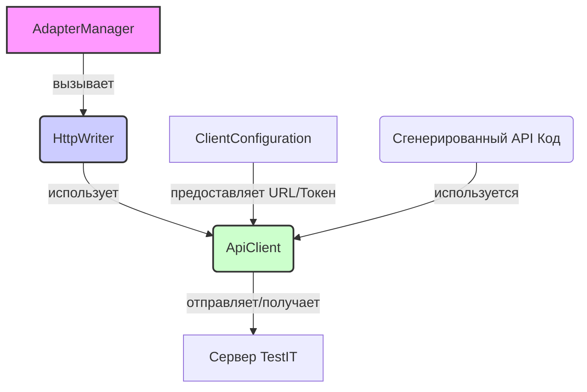
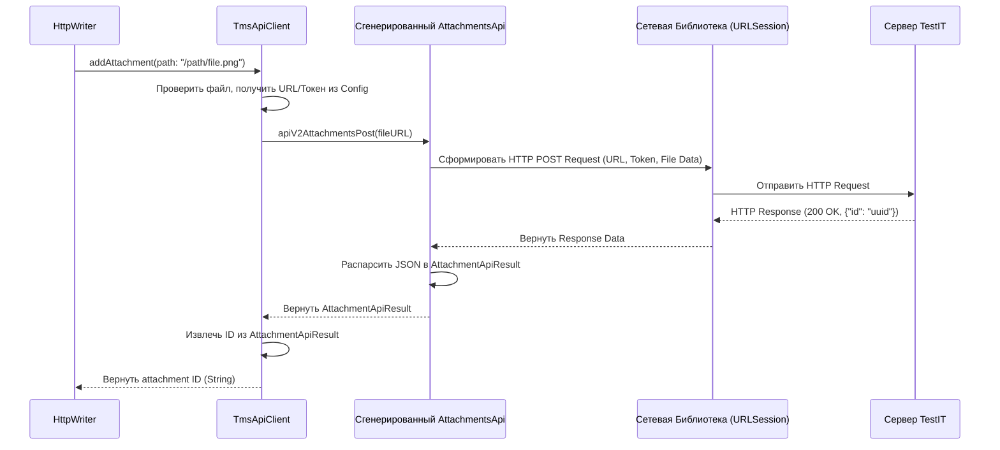

# Chapter 8: Клиент API TestIT (ApiClient / TmsApiClient)


В предыдущей главе, [Отправщик Результатов (Writer / HttpWriter)](07_отправщик_результатов__writer___httpwriter__.md), мы познакомились с "почтальоном" адаптера — компонентом `Writer`, который берет готовые результаты тестов и отвечает за их отправку. Мы узнали, что `Writer`, в частности `HttpWriter`, получает задачу доставить данные на сервер TestIT.

Но как именно `HttpWriter` общается с сервером? Он же не может просто "крикнуть" данные через интернет! Ему нужен кто-то, кто знает точный "язык" сервера TestIT (его API), умеет правильно упаковывать "посылки" (данные) в нужный формат (HTTP-запросы) и знает, как их доставить по адресу.

**Проблема:** Нам нужен специализированный компонент, который будет непосредственно общаться с сервером TestIT по сети. Он должен уметь преобразовывать внутренние данные адаптера в запросы, понятные API TestIT, отправлять их, обрабатывать ответы и сообщать об успехе или ошибке.

## Что такое `ApiClient`? Переводчик и курьер для TestIT

**Клиент API TestIT** — это именно такой компонент. Давайте воспользуемся описанием из начала:

> Представьте его как **переводчика и курьера** в одном лице: он берет данные о тестах от адаптера, переводит их в понятный для сервера TestIT формат (API запросы) и отправляет по сети, а также получает ответы от сервера.

Другими словами, `ApiClient`:

1.  **Знает API:** Он знает все "правила общения" с сервером TestIT — какие URL-адреса использовать для разных действий (создать тест-ран, отправить результат, загрузить файл), какие данные и в каком формате (JSON) отправлять, как проходить аутентификацию (используя ваш `privateToken`).
2.  **Формирует Запросы:** Он берет внутренние объекты адаптера (такие как [TestResultCommon](05_модель_результата_теста__testresultcommon__.md)) и преобразует их в специальные объекты-модели, соответствующие ожидаемому формату API TestIT (например, `AutoTestResultsForTestRunModel`). Затем он упаковывает эти данные в HTTP-запросы (POST, GET и т.д.).
3.  **Отправляет по Сети:** Используя стандартные сетевые библиотеки Swift, он отправляет сформированный запрос на URL вашего сервера TestIT, указанный в [Конфигурации Адаптера](01_конфигурация_адаптера_.md).
4.  **Обрабатывает Ответы:** Он получает ответ от сервера (например, подтверждение успеха, ID созданного объекта или сообщение об ошибке), разбирает его и передает результат компоненту, который его вызвал (обычно это [HttpWriter](07_отправщик_результатов__writer___httpwriter__.md)).

В `adapters-swift` эта концепция реализована через:

*   **Протокол `ApiClient`:** Это как список задач или "должностная инструкция" для любого клиента API. Он определяет, *какие* действия клиент *должен* уметь выполнять (создать тест-ран, отправить результаты, загрузить вложение и т.д.).
*   **Реализация `TmsApiClient`:** Это конкретный "сотрудник", выполняющий эти задачи. `TmsApiClient` — это класс, который реализует протокол `ApiClient`. Он использует [Конфигурацию Клиента (`ClientConfiguration`)](01_конфигурация_адаптера_.md) для получения адреса сервера и токена, а также (часто) **автоматически сгенерированный код**, созданный на основе официального описания API TestIT (например, из файла OpenAPI/Swagger). Этот сгенерированный код предоставляет готовые функции для каждого метода API и соответствующие модели данных.

## Как используется `ApiClient`? (В основном, для `HttpWriter`)

Подобно [Хранилищу Результатов (ResultStorage)](06_хранилище_результатов__resultstorage__.md) и [Отправщику Результатов (Writer / HttpWriter)](07_отправщик_результатов__writer___httpwriter__.md), вы, как пользователь адаптера, **редко будете взаимодействовать с `ApiClient` напрямую**.

Его основной "клиент" — это `HttpWriter`. Когда `HttpWriter` получает команду, например, отправить результат теста:

1.  Он вызывает соответствующий метод у `ApiClient` (например, `apiClient.sendTestResults(...)`), передавая ему необходимые данные.
2.  `ApiClient` выполняет всю работу по формированию запроса, отправке его по сети и получению ответа.
3.  `ApiClient` возвращает результат (например, ID созданного результата или ошибку) обратно `HttpWriter`.



**Пояснение:** Диаграмма показывает, что `AdapterManager` использует `HttpWriter`, который, в свою очередь, полагается на `ApiClient` для сетевого взаимодействия. `ApiClient` использует `ClientConfiguration` и сгенерированный код для общения с сервером TestIT.

## Заглянем под капот: Путешествие API-запроса

Давайте представим, что `HttpWriter` хочет загрузить вложение (скриншот) и вызывает метод `apiClient.addAttachment(path: "/путь/к/скриншот.png")` у экземпляра `TmsApiClient`. Что происходит дальше?

1.  **Получение Пути:** `TmsApiClient` получает путь к файлу.
2.  **Проверка Файла:** Он проверяет, существует ли файл по указанному пути.
3.  **Получение Конфигурации:** `TmsApiClient` обращается к своему объекту `ClientConfiguration`, чтобы получить базовый URL сервера TestIT (`https://your_company.testit.software`) и `privateToken`.
4.  **Вызов Сгенерированного Кода:** `TmsApiClient` использует соответствующий *сгенерированный* метод API, например, `attachmentsApi.apiV2AttachmentsPost(fileURL)`. Этот метод уже знает:
    *   Точный URL-путь для загрузки вложений (например, `/api/v2/attachments`).
    *   Что нужно использовать HTTP-метод POST.
    *   Что файл нужно отправить в теле запроса особым образом (`multipart/form-data`).
    *   Что нужно добавить заголовок `Authorization` со значением `PrivateToken ВАШ_ТОКЕН`.
5.  **Формирование HTTP Запроса:** Сгенерированный метод (или базовая сетевая библиотека, которую он использует) создает полный HTTP-запрос с правильными заголовками, методом и телом, содержащим данные файла.
6.  **Отправка по Сети:** Запрос отправляется на `https://your_company.testit.software/api/v2/attachments`.
7.  **Ожидание Ответа:** Клиент ждет ответа от сервера TestIT.
8.  **Обработка Ответа:** Сервер TestIT, успешно загрузив файл, возвращает ответ, например, `200 OK` с телом JSON, содержащим ID нового вложения: `{"id": "НОВЫЙ_UUID_ВЛОЖЕНИЯ"}`.
9.  **Разбор Ответа:** Сгенерированный код автоматически разбирает этот JSON и преобразует его в объект (например, `AttachmentApiResult`), содержащий `id`.
10. **Возврат Результата:** `TmsApiClient` получает этот `AttachmentApiResult`, извлекает из него `id` ("НОВЫЙ_UUID_ВЛОЖЕНИЯ") и возвращает его как строку вызвавшему коду (т.е. `HttpWriter`).

**Диаграмма Последовательности (Загрузка Вложения):**



### Код: `ApiClient` (Протокол) и `TmsApiClient` (Реализация)

**1. `ApiClient.swift` (Протокол)**

Протокол определяет "что" должен уметь делать клиент.

```swift
// Описывает контракт взаимодействия с API TestIT
protocol ApiClient {
    // Управление Тест-Ранами
    func createTestRun() throws -> TestRunV2ApiResult // Создать новый тест-ран
    func getTestRun(uuid: String) throws -> TestRunV2ApiResult // Получить инфо о тест-ране
    func completeTestRun(uuid: String) throws // Завершить тест-ран

    // Управление Автотестами
    func updateAutoTest(model: AutoTestPutModel) throws // Обновить существующий автотест
    func createAutoTest(model: AutoTestPostModel) throws -> String // Создать новый автотест
    func getAutoTestByExternalId(externalId: String) throws -> AutoTestApiResult? // Найти автотест по External ID

    // Связь с Work Items
    func linkAutoTestToWorkItems(id: String, workItemIds: [String]) throws // Привязать к задачам
    
    // Результаты и Вложения
    func sendTestResults(testRunUuid: String, models: [AutoTestResultsForTestRunModel]) throws -> [String] // Отправить результаты
    func addAttachment(path: String) throws -> String // Загрузить вложение
    // ... и другие методы ...
}
```

**Пояснение:**
Этот протокол перечисляет основные операции, необходимые адаптеру для интеграции с TestIT, такие как управление тест-ранами, автотестами, ссылками и отправка результатов/вложений. Типы вроде `TestRunV2ApiResult`, `AutoTestPutModel`, `AutoTestResultsForTestRunModel` — это как раз те самые модели данных, специфичные для API TestIT (часто генерируемые).

**2. `TmsApiClient.swift` (Упрощенная Реализация)**

Этот класс реализует протокол `ApiClient`, используя конфигурацию и сгенерированные API-клиенты.

```swift
import Foundation
import os.log // Для логирования

// Реализация ApiClient для TestIT TMS
class TmsApiClient: ApiClient {
    private static let logger = Logger(subsystem: "TestItAdapter", category: "TmsApiClient")

    // Хранит конфигурацию (URL, токен и т.д.)
    private let clientConfiguration: ClientConfiguration

    // Ссылки на СГЕНЕРИРОВАННЫЕ клиенты для разных разделов API
    private let testRunsApi: TestRunsApi
    private let autoTestsApi: AutoTestsApi
    private let attachmentsApi: AttachmentsApi
    // ... другие API клиенты (TestResultsApi и т.д.)

    // Инициализатор: получает конфигурацию и создает экземпляры API клиентов
    init(configuration: ClientConfiguration) {
        Self.logger.debug("Инициализация TmsApiClient...")
        self.clientConfiguration = configuration

        // Убедимся, что URL корректный
        guard !configuration.url.isEmpty, configuration.url.lowercased() != "null" else {
             let errorMsg = "Невозможно инициализировать TmsApiClient: URL сервера отсутствует или некорректен."
             Self.logger.critical("\(errorMsg)")
             fatalError(errorMsg) // Критическая ошибка, если URL нет
        }
        let baseUrl = configuration.url

        // Создаем экземпляры сгенерированных клиентов, передавая базовый URL
        // В реальном коде здесь используются классы, сгенерированные из API TestIT
        self.testRunsApi = TestRunsApi(baseUrl) // Пример
        self.autoTestsApi = AutoTestsApi(baseUrl) // Пример
        self.attachmentsApi = AttachmentsApi(baseUrl) // Пример
        // ... инициализация других API ...

        // Применяем общие настройки (токен, SSL) ко всем клиентам
        self.configureApiClient(self.testRunsApi)
        self.configureApiClient(self.autoTestsApi)
        self.configureApiClient(self.attachmentsApi)
        // ... конфигурация других API ...
        Self.logger.debug("TmsApiClient инициализирован.")
    }

    // Вспомогательный метод для настройки токена и SSL
    private func configureApiClient<T: InfrastructureApiClient>(_ client: T) {
        var mutableClient = client
        let authToken = self.clientConfiguration.privateToken
        mutableClient.apiKeyPrefix["Authorization"] = "PrivateToken" // Стандартный префикс
        mutableClient.apiKey["Authorization"] = authToken // Устанавливаем токен
        mutableClient.verifyingSsl = self.clientConfiguration.certValidation // Настройка проверки SSL
        Self.logger.debug("Настроен API клиент: \(type(of: client)), SSL=\(mutableClient.verifyingSsl)")
    }

    // --- Реализация методов протокола ApiClient ---

    // Пример: Загрузка вложения
    func addAttachment(path: String) throws -> String {
        Self.logger.debug("Загрузка вложения из пути: \(path)")
        let fileURL = URL(fileURLWithPath: path)

        // Проверка существования файла
        guard FileManager.default.fileExists(atPath: path) else {
             Self.logger.error("Ошибка: Файл вложения не найден: \(path)")
             throw TmsApiClientError.fileNotFound(path) // Бросаем ошибку
        }

        do {
            // Вызов метода СГЕНЕРИРОВАННОГО клиента attachmentsApi
            let model: AttachmentApiResult = try attachmentsApi.apiV2AttachmentsPost(fileURL)
            let attachmentId = model.id.uuidString // Получаем ID из ответа
            Self.logger.info("Вложение успешно загружено. ID: \(attachmentId)")
            return attachmentId // Возвращаем ID как строку
        } catch {
            Self.logger.error("Ошибка загрузки вложения '\(path)': \(error.localizedDescription)")
            throw error // Перебрасываем ошибку выше
        }
    }

    // Пример: Отправка результатов тестов
    func sendTestResults(testRunUuid: String, models: [AutoTestResultsForTestRunModel]) throws -> [String] {
        guard let runUUID = UUID(uuidString: testRunUuid) else {
            throw TmsApiClientError.invalidUUIDFormat("Некорректный UUID тест-рана: \(testRunUuid)")
        }
        Self.logger.debug("Отправка \(models.count) результатов для тест-рана \(testRunUuid)...")
        do {
            // Вызов метода СГЕНЕРИРОВАННОГО клиента testRunsApi
            let resultUUIDs: [UUID] = try testRunsApi.setAutoTestResultsForTestRun(runUUID, models)
            Self.logger.info("Успешно отправлено \(models.count) результатов. Получено ID: \(resultUUIDs.count)")
            return resultUUIDs.map { $0.uuidString } // Возвращаем список ID как строки
        } catch {
            Self.logger.error("Ошибка отправки результатов для \(testRunUuid): \(error.localizedDescription)")
            throw error
        }
    }

    // ... Реализация всех других методов протокола ApiClient ...
    // (createTestRun, updateAutoTest, linkAutoTestToWorkItems и т.д.)
    // Все они будут похожи: вызов соответствующего метода
    // у сгенерированного клиента (testRunsApi, autoTestsApi, etc.)
    // с обработкой ошибок.
    
    // --- Необходимые для компиляции заглушки (заменить реальной логикой) ---
    func createTestRun() throws -> TestRunV2ApiResult { /* ... using testRunsApi ... */ throw TmsApiClientError.notImplemented("createTestRun") }
    func getTestRun(uuid: String) throws -> TestRunV2ApiResult { /* ... using testRunsApi ... */ throw TmsApiClientError.notImplemented("getTestRun") }
    func completeTestRun(uuid: String) throws { /* ... using testRunsApi ... */ throw TmsApiClientError.notImplemented("completeTestRun") }
    func getTestFromTestRun(testRunUuid: String, configurationId: String) throws -> [String] { /* ... using testRunsApi ... */ throw TmsApiClientError.notImplemented("getTestFromTestRun") }
    func updateAutoTest(model: AutoTestPutModel) throws { /* ... using autoTestsApi ... */ throw TmsApiClientError.notImplemented("updateAutoTest") }
    func createAutoTest(model: AutoTestPostModel) throws -> String { /* ... using autoTestsApi ... */ throw TmsApiClientError.notImplemented("createAutoTest") }
    func getAutoTestByExternalId(externalId: String) throws -> AutoTestApiResult? { /* ... using autoTestsApi ... */ throw TmsApiClientError.notImplemented("getAutoTestByExternalId") }
    func linkAutoTestToWorkItems(id: String, workItemIds: [String]) throws { /* ... using autoTestsApi ... */ throw TmsApiClientError.notImplemented("linkAutoTestToWorkItems") }
    func unlinkAutoTestToWorkItem(id: String, workItemId: String) throws -> Bool { /* ... using autoTestsApi ... */ throw TmsApiClientError.notImplemented("unlinkAutoTestToWorkItem") }
    func getWorkItemsLinkedToTest(id: String) throws -> [WorkItemIdentifierModel] { /* ... using autoTestsApi ... */ throw TmsApiClientError.notImplemented("getWorkItemsLinkedToTest") }
    func getTestResult(uuid: UUID) throws -> TestResultResponse { /* ... using testResultsApi ... */ throw TmsApiClientError.notImplemented("getTestResult") }
    func updateTestResult(uuid: UUID, model: TestResultUpdateV2Request) throws { /* ... using testResultsApi ... */ throw TmsApiClientError.notImplemented("updateTestResult") }
}

// Определим пользовательские ошибки для большей ясности
enum TmsApiClientError: Error, LocalizedError {
    case invalidConfiguration(String)
    case invalidUUIDFormat(String)
    case missingApiResponseData(String)
    case fileNotFound(String)
    case notImplemented(String) // Для заглушек

    var errorDescription: String? {
        // ... (сообщения об ошибках) ...
        switch self {
        case .invalidConfiguration(let reason): return "Некорректная конфигурация клиента: \(reason)"
        case .invalidUUIDFormat(let reason):    return "Некорректный формат UUID: \(reason)"
        case .missingApiResponseData(let reason):return "Отсутствуют данные в ответе API: \(reason)"
        case .fileNotFound(let path):           return "Файл не найден: \(path)"
        case .notImplemented(let method):       return "Метод не реализован: \(method)"
        }
    }
}
```

**Пояснение:**
Этот код показывает ключевые аспекты `TmsApiClient`:
1.  **Зависимость от Конфигурации:** Он получает `ClientConfiguration` при создании.
2.  **Использование Сгенерированных Клиентов:** Он создает и использует экземпляры сгенерированных API-клиентов (`TestRunsApi`, `AutoTestsApi` и т.д.) для выполнения специфических запросов к разным частям API TestIT.
3.  **Применение Настроек:** Он настраивает базовые параметры, такие как `apiKey` (токен) и `verifyingSsl` (проверка SSL-сертификата), для всех используемых API-клиентов.
4.  **Реализация Методов Протокола:** Каждый метод, требуемый протоколом `ApiClient` (например, `addAttachment`, `sendTestResults`), реализуется путем вызова соответствующего метода у соответствующего сгенерированного клиента (`attachmentsApi`, `testRunsApi`).
5.  **Обработка Ошибок и Логирование:** В методах присутствует логирование и обработка ошибок, которые могут возникнуть при сетевом взаимодействии или при работе с файлами.

## Заключение

**Клиент API TestIT (`ApiClient` / `TmsApiClient`)** — это низкоуровневый, но абсолютно необходимый компонент `adapters-swift`. Это "переводчик и курьер", который непосредственно общается с вашим сервером TestIT по сети.

*   Он знает "язык" сервера (API TestIT), часто с помощью **автоматически сгенерированного кода**.
*   Он использует [Конфигурацию Клиента](01_конфигурация_адаптера_.md) для получения адреса сервера и токена доступа.
*   Он преобразует внутренние данные адаптера в API-запросы, отправляет их и обрабатывает ответы.
*   Его основными "пользователями" внутри адаптера являются [HttpWriter](07_отправщик_результатов__writer___httpwriter__.md) и, возможно, [AdapterManager](03_менеджер_адаптера__adaptermanager__.md) для некоторых операций (например, получение списка тестов из тест-рана).

Понимание роли `ApiClient` завершает наше путешествие по основным компонентам `adapters-swift`. Мы увидели весь путь: от настройки адаптера и подключения к тестам до сбора данных, их временного хранения и финальной отправки через сеть с помощью клиента API.

Вы изучили все основные механизмы, которые позволяют `adapters-swift` связывать ваши Xcode тесты с TestIT! Теперь вы имеете представление о том, как адаптер работает "под капотом".

---

Generated by [AI Codebase Knowledge Builder](https://github.com/The-Pocket/Tutorial-Codebase-Knowledge)