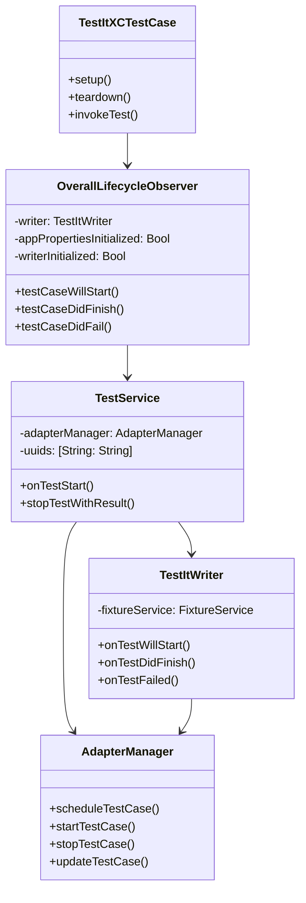
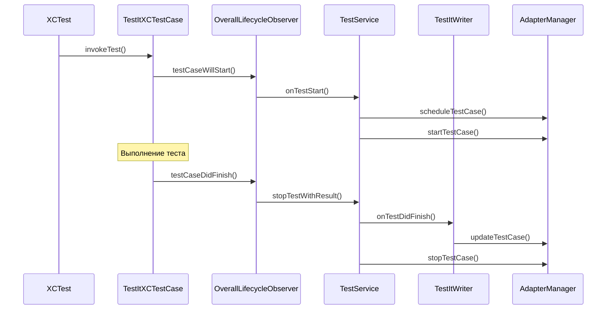

# Архитектура TestIT Swift Adapter

## Обзор системы

TestIT Swift Adapter - это библиотека для интеграции XCTest с системой TestIT. Она позволяет автоматически собирать результаты тестов и отправлять их в TestIT.

## Ключевые компоненты

### 1. Основные сущности

### 2. Жизненный цикл теста

## Описание компонентов

### TestItXCTestCase
Базовый класс для всех тестов, который интегрируется с TestIT. Наследуется от XCTestCase и добавляет функциональность для сбора и отправки результатов тестов.

### OverallLifecycleObserver
Наблюдатель за жизненным циклом тестов. Реализует протокол XCTestObservation и отслеживает все события тестирования:
- Начало теста
- Завершение теста
- Ошибки в тесте
- Начало и завершение тестового набора

### TestService
Сервис, отвечающий за управление тестами. Основные функции:
- Инициализация теста
- Обработка результатов теста
- Управление статусами тестов
- Интеграция с контекстом TestIT

### TestItWriter
Компонент, отвечающий за запись результатов тестов. Взаимодействует с:
- FixtureService для управления фикстурами
- AdapterManager для отправки результатов
- Хранение и обработка ошибок тестов

### AdapterManager
Менеджер адаптера, который координирует:
- Планирование тестов
- Запуск тестов
- Остановку тестов
- Обновление статусов тестов

## Процесс выполнения теста

1. **Инициализация**
   - Создание экземпляра TestItXCTestCase
   - Регистрация OverallLifecycleObserver
   - Инициализация TestService и TestItWriter

2. **Выполнение теста**
   - Вызов testCaseWillStart
   - Выполнение тестового кода
   - Сбор результатов и ошибок
   - Вызов testCaseDidFinish

3. **Обработка результатов**
   - Обновление статуса теста
   - Запись ошибок и трассировки
   - Отправка результатов в TestIT

## Интеграция с TestIT

Система интегрируется с TestIT через:
- Отправку результатов тестов
- Синхронизацию статусов
- Управление контекстом тестов
- Обработку фикстур и предварительных условий 