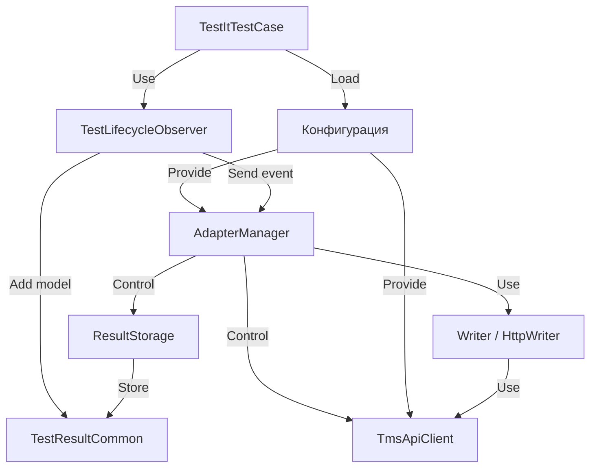

# Tutorial: adapters-swift

Этот проект представляет собой **адаптер** для интеграции автоматических тестов, написанных на Swift с использованием фреймворка *XCTest*, с системой управления тестированием TestIT.
Он позволяет автоматически отправлять результаты ваших тестов (*статус выполнения*, *шаги*, *вложения*, *ссылки*) в TestIT.
Основная идея в том, что вы наследуете свои тестовые классы от специального базового класса (`TestItTestCase`), а адаптер сам перехватывает информацию о запуске тестов и отправляет ее в TestIT через *ApiClient*, используя настройки из файла `testit.properties`. **Менеджер адаптера** (`AdapterManager`) координирует весь процесс.

**Source Repository:** [None](None)

## Chapters

1. [Конфигурация Адаптера
](01_конфигурация_адаптера_.md)
2. [Базовый Тестовый Класс (TestItTestCase)
](02_базовый_тестовый_класс__testittestcase__.md)
3. [Менеджер Адаптера (AdapterManager)
](03_менеджер_адаптера__adaptermanager__.md)
4. [Наблюдатель Жизненного Цикла Теста (TestLifecycleObserver)
](04_наблюдатель_жизненного_цикла_теста__testlifecycleobserver__.md)
5. [Модель Результата Теста (TestResultCommon)
](05_модель_результата_теста__testresultcommon__.md)
6. [Хранилище Результатов (ResultStorage)
](06_хранилище_результатов__resultstorage__.md)
7. [Отправщик Результатов (Writer / HttpWriter)
](07_отправщик_результатов__writer___httpwriter__.md)
8. [Клиент API TestIT (ApiClient / TmsApiClient)
](08_клиент_api_testit__apiclient___tmsapiclient__.md)

---

Generated by [AI Codebase Knowledge Builder](https://github.com/The-Pocket/Tutorial-Codebase-Knowledge)